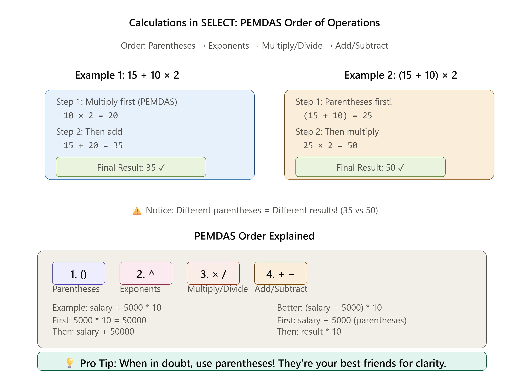
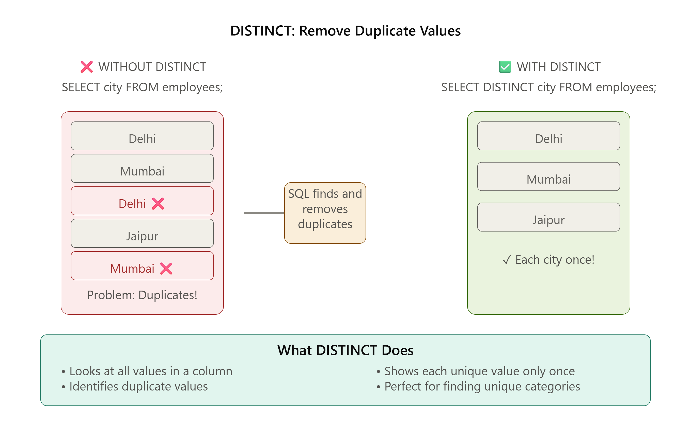
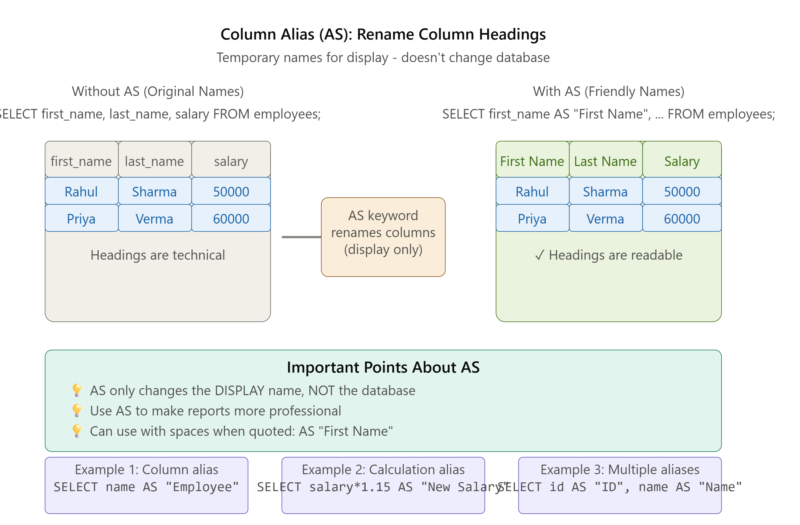

# 🎯 SQL Phase 1: Core Foundations -

## With Hands-On Learning, Visual Guides & Practice Exercises

---

# 🗄️ What is SQL?

## 📖 Definition

**SQL (Structured Query Language)** is a programming language used to **communicate with databases**.

It helps us **store, retrieve, update, and delete data** from a database.

> 💡 **Simple Definition:**  
> **SQL is a language that lets you talk to a database and ask it to perform tasks like showing, adding, updating, or deleting data.**

---

# 🔤 Full Form of SQL

**SQL** stands for:

**S** → Structured  
**Q** → Query  
**L** → Language

### What does it mean?

- **Structured** → Data is organized in tables.
- **Query** → A request or question you ask the database.
- **Language** → A way to communicate with the database.

---

# 📚 What is a Database?

A **database** is a place where information is stored in an organized way.

For example, a school database may contain:

- 👨‍🎓 Students
- 👨‍🏫 Teachers
- 📚 Books
- 💰 Fees
- 📝 Exams

Each type of information is stored in its own **table**.

---

# 📋 Example Table: Students

| Student_ID | Name | Age | City |
|------------|------|-----|--------|
| 101 | Rahul | 15 | Delhi |
| 102 | Priya | 16 | Mumbai |
| 103 | Aman | 14 | Jaipur |

---

# 💬 What Can SQL Do?

SQL allows you to:

- 👀 View data
- ➕ Add new data
- ✏️ Update existing data
- ❌ Delete data
- 🔍 Search for specific information
- 📊 Sort and organize data

---

# 📝 Example SQL Query

```sql
SELECT Name
FROM Students;
```

### 📊 Output

| Name |
|------|
| Rahul |
| Priya |
| Aman |

**Explanation:**

- `SELECT` → Show me the data.
- `Name` → I want the Name column.
- `FROM Students` → Get the data from the Students table.

---

# 🌍 Real-World Examples

### 🏫 School

Find all student names.

```sql
SELECT Name
FROM Students;
```

---

### 🏦 Bank

Show all customer names.

```sql
SELECT Customer_Name
FROM Customers;
```

---

### 🛒 Online Shopping

Show all product names.

```sql
SELECT Product_Name
FROM Products;
```

---

### 🏥 Hospital

Show all patient names.

```sql
SELECT Patient_Name
FROM Patients;
```

---

# 🎯 Why Do We Learn SQL?

SQL is used by:

- 💻 Software Developers
- 📊 Data Analysts
- 🤖 Data Scientists
- 🏢 Database Administrators (DBAs)
- 📈 Business Analysts

Almost every company that stores data uses SQL.

---

👦 **You say:**

> "Show me all student names."

🤖 **SQL understands your request and gets the information from the database.**

---

# 📝 Summary

| Term | Meaning |
|------|---------|
| SQL | Structured Query Language |
| Database | A collection of organized data |
| Table | Stores related information in rows and columns |
| Query | A request sent to the database |
| SELECT | Retrieves data from a table |

---

# 💡 Remember This

> **SQL is the language used to communicate with a database.**

Just like we use **English** to talk to people, we use **SQL** to talk to databases and ask them to store, retrieve, update, or delete information.

---

---

# 📌 Part 1: SELECT Statement

## What Does It Do?

SELECT tells SQL which data you want to see from a table.

The SELECT statement is used to read or display data from a database table.

It does not change the data. It only shows the information you request.

### Basic Formula

```sql
SELECT column_name 
FROM table_name;
```

### The Three Important Words

- **SELECT** = "I want to see..."
- **FROM** = "...from this table"
- **;** = "...done!" (semicolon ends the query)

---

## Example 1: Get Everything

```sql
SELECT * 
FROM students;
```

**Translation:** "Show me EVERYTHING from the students table"

- `*` = "all columns" (the asterisk means "everything")

**Output:**

```
id | name        | age | city
1  | Ali         | 20  | Delhi
2  | Priya       | 22  | Mumbai
3  | Raj         | 21  | Bangalore
```

---

## Example 2: Get Specific Columns

```sql
SELECT Name, Age 
FROM students;
```

**Translation:** "Show me only the NAME and AGE columns from students"

**Output:**

```
name    | age
Ali     | 20
Priya   | 22
Raj     | 21
```

---

## How SELECT Works

```
Database
    │
    ▼
Students Table
    │
    ▼
SELECT Name, Age
    │
    ▼
Returns only Name and Age
```

### 📊 Visual 1: How SELECT Works

This diagram shows you step-by-step how SQL SELECT picks columns from a table.

**Key Concepts:**

- Table on the left has all columns
- SELECT picks only the columns you need
- Result shows only selected columns

**Click on any part of the diagram to learn more!**

---

---

# 📚 Real-World Example: Understanding `SELECT`

Imagine you have a **school database**.

Inside the database, there is a table called **Students**.

| ID | Name  | Age | City   |
|----|-------|-----|--------|
| 1  | Rahul | 15  | Delhi  |
| 2  | Priya | 16  | Mumbai |
| 3  | Aman  | 15  | Jaipur |

---

## 1️⃣ Show Only Student Names

If you only want to see the **Name** column, use:

```sql
SELECT Name
FROM Students;
```

### 📋 Output

| Name |
|------|
| Rahul |
| Priya |
| Aman |

**🧠 Easy Explanation**

- `SELECT Name` → Show only the **Name** column.
- `FROM Students` → Get the data from the **Students** table.

Think of it as saying:

> **"Show me only the student names."**

---

## 2️⃣ Show Student Names and Cities

If you want to see both the **Name** and **City** columns:

```sql
SELECT Name, City
FROM Students;
```

### 📋 Output

| Name | City |
|------|--------|
| Rahul | Delhi |
| Priya | Mumbai |
| Aman | Jaipur |

**🧠 Easy Explanation**

- `SELECT Name, City` → Show only the **Name** and **City** columns.
- `FROM Students` → Get the data from the **Students** table.

Think of it as saying:

> **"Show me the student names and the cities they live in."**

---

## 3️⃣ Show Every Piece of Information

If you want to see **all the information** stored in the table:

```sql
SELECT *
FROM Students;
```

### 📋 Output

| ID | Name | Age | City |
|----|------|-----|--------|
| 1 | Rahul | 15 | Delhi |
| 2 | Priya | 16 | Mumbai |
| 3 | Aman | 15 | Jaipur |

**🧠 Easy Explanation**

- `SELECT *` → Show **every column**.
- `FROM Students` → Get the data from the **Students** table.

The `*` (star) means:

> **"Show me everything."**

---

# 🎯 Quick Summary

| SQL Query | What It Does |
|-----------|--------------|
| `SELECT Name FROM Students;` | Shows only the **Name** column. |
| `SELECT Name, City FROM Students;` | Shows only the **Name** and **City** columns. |
| `SELECT * FROM Students;` | Shows **all columns** from the table. |

---

## 💡 Easy Way to Remember

```text
SELECT = Show me
FROM   = From this table
*      = Everything
```

So,

```sql
SELECT *
FROM Students;
```

Simply means:

> **"Show me everything from the Students table."**

---

# 🚫 Why Don't We Always Use `SELECT *`?

Using `SELECT *` tells SQL to return **every column** from a table.

While this is useful for learning or quickly viewing data, it is **not always the best choice**.

---

## 📚 Imagine This

Your **Students** table has **100 columns**.

You only want to know the student's **Name**.

If you write:

```sql
SELECT *
FROM Students;
```

SQL returns **everything**:

- 👤 Name
- 🎂 Age
- 🏠 Address
- 📞 Phone Number
- 👨‍👩‍👧 Parent Name
- 🩸 Blood Group
- 🎓 Roll Number
- 🏫 Class
- 📧 Email
- 📍 City
- ...and many more columns.

Most of this information is **not needed**.

---

## ✅ A Better Way

If you only need the student's name, ask for **only that column**.

```sql
SELECT Name
FROM Students;
```

### 📋 Output

| Name |
|------|
| Rahul |
| Priya |
| Aman |

---

## 💡 Why Is This Better?

- ⚡ Returns data faster.
- 📖 Makes the result easier to read.
- 💾 Uses fewer system resources.
- 🎯 Retrieves only the information you actually need.

> **Best Practice:** Instead of asking for everything (`*`), select only the columns you need.

---

# 🧠 How SQL Reads Your Query

Suppose you write:

```sql
SELECT Name, Age
FROM Students;
```

SQL reads the query step by step.

---

## Step 1️⃣: What do you want?

```text
SELECT Name, Age
```

SQL understands:

> **"The user wants the Name and Age columns."**

---

## Step 2️⃣: Where should I look?

```text
FROM Students
```

SQL understands:

> **"Look inside the Students table."**

---

## Step 3️⃣: Return the Result

After finding the requested columns, SQL displays them.

### 📋 Output

| Name | Age |
|------|-----|
| Rahul | 15 |
| Priya | 16 |
| Aman | 15 |

---

# 🔄 SQL Thinking Process

```text
                SQL Query
                    │
                    ▼
        SELECT Name, Age
                    │
                    ▼
      "I need the Name and Age columns."
                    │
                    ▼
          FROM Students
                    │
                    ▼
      "Look inside the Students table."
                    │
                    ▼
        Find the requested data
                    │
                    ▼
          Display the result
```

---

# 🎯 Easy Way to Remember

Think of SQL as a helpful librarian.

👦 **You ask:**

> "Please show me the Name and Age of all students."

📚 **The librarian thinks:**

1. 🤔 **What information do you want?**
   - Name and Age

2. 🔍 **Where should I look?**
   - Students table

3. ✅ **Here is the information you asked for.**

That's exactly how SQL processes every `SELECT` query.

---

# 📝 Summary

| Query | Meaning |
|-------|---------|
| `SELECT * FROM Students;` | Show **all columns** from the Students table. |
| `SELECT Name FROM Students;` | Show **only the Name** column. |
| `SELECT Name, Age FROM Students;` | Show **only the Name and Age** columns. |

> 💡 **Remember:** Ask SQL only for the data you need. It makes your queries faster, cleaner, and easier to understand.

---

---

# 🧮 PEMDAS in SQL

## 📖 What is PEMDAS?

**PEMDAS** is a rule that tells SQL (and mathematics) **the order in which calculations should be performed** when an expression contains multiple operators.

### 🔤 Full Form of PEMDAS

| Letter | Meaning |
|---------|---------|
| **P** | Parentheses `()` |
| **E** | Exponents (Powers) |
| **M** | Multiplication `*` |
| **D** | Division `/` |
| **A** | Addition `+` |
| **S** | Subtraction `-` |

> 💡 **Easy Tip:** SQL follows the same calculation rules that you learned in mathematics.

---

## 🧠 Order of Operations

SQL performs calculations in this order:

```text
1️⃣ Parentheses   ()
2️⃣ Exponents     ^
3️⃣ Multiplication *
4️⃣ Division      /
5️⃣ Addition      +
6️⃣ Subtraction   -
```

---

## 📌 Example

```sql
SELECT
    first_name,
    age,
    age + 10 * 2
FROM Students;
```

If a student's age is **15**, SQL calculates:

```text
15 + 10 × 2

Step 1:
10 × 2 = 20

Step 2:
15 + 20 = 35
```

**Result:** `35`

---

## 📌 Using Parentheses

```sql
SELECT
    first_name,
    age,
    (age + 10) * 2
FROM Students;
```

Now SQL calculates:

```text
(15 + 10) × 2

Step 1:
15 + 10 = 25

Step 2:
25 × 2 = 50
```

**Result:** `50`

---

## 💡 Why is PEMDAS Important?

PEMDAS helps SQL perform calculations correctly.

Without following the correct order, the result could be different.

For example:

```text
15 + 10 × 2 = 35
```

is **not** the same as:

```text
(15 + 10) × 2 = 50
```

---

## 🎯 Easy Way to Remember

> **PEMDAS = The rule that tells SQL which calculation to do first.**

Think of it like following a recipe:

1. 🥣 Mix the ingredients (Parentheses)
2. 🍳 Cook them (Multiply/Divide)
3. 🍽️ Add the finishing touches (Add/Subtract)

#### Following the correct order gives you the correct result every time

---

# 📚 SQL Example: Using Calculations in `SELECT`

The `SELECT` statement can do more than just display data.

It can also perform **calculations** while retrieving data.

> **Note:** These calculations only affect the result shown on the screen. They **do not change** the original data stored in the database.

---

## 📋 Students Table

| student_id | first_name | last_name | age |
|------------|------------|-----------|-----|
| 101 | Rahul | Sharma | 15 |
| 102 | Priya | Verma | 16 |
| 103 | Aman | Singh | 14 |
| 104 | Neha | Patel | 17 |

---

# 📝 SQL Query

```sql
SELECT
    first_name,
    last_name,
    age,
    age + 10
FROM Students;
```

---

# 📊 Output

| first_name | last_name | age | age + 10 |
|------------|-----------|-----|----------|
| Rahul | Sharma | 15 | 25 |
| Priya | Verma | 16 | 26 |
| Aman | Singh | 14 | 24 |
| Neha | Patel | 17 | 27 |

---

# 🧠 How SQL Reads This Query

```sql
SELECT
    first_name,
    last_name,
    age,
    age + 10
FROM Students;
```

### Step 1️⃣: What do you want?

SQL reads:

```text
first_name
last_name
age
age + 10
```

It understands:

> **"Show the student's first name, last name, age, and also calculate age + 10."**

---

### Step 2️⃣: Where should I look?

```sql
FROM Students;
```

SQL understands:

> **"Find this information in the Students table."**

---

### Step 3️⃣: Display the Result

SQL calculates the new value and shows it in the result.

Example:

```text
Rahul's Age = 15

15 + 10 = 25
```

The result becomes:

| first_name | age | age + 10 |
|------------|-----|----------|
| Rahul | 15 | 25 |

---

# 💡 Important Note

The query

```sql
SELECT age + 10
FROM Students;
```

**does NOT update the age in the database.**

It only performs a calculation while displaying the result.

For example:

```text
Database Value

Age = 15
```

After running the query:

```sql
SELECT age + 10
FROM Students;
```

The output is:

```text
25
```

But the value stored in the database is still:

```text
Age = 15
```

---

# 📖 Easy Explanation

Think of it like a calculator.

If your age is **15** and someone asks:

> **"What will your age be after adding 10 years?"**

You answer:

```text
15 + 10 = 25
```

Your actual age **does not become 25**.

You only **calculated** it.

SQL works exactly the same way.

---

# 🎯 Key Points

- ✅ `SELECT` retrieves data from a table.
- ✅ You can perform calculations inside `SELECT`.
- ✅ `FROM` tells SQL which table to read.
- ✅ The original data is **never changed** by a `SELECT` query.
- ✅ Calculated values exist only in the query result.

---

# 📝 Summary

| SQL Statement | Meaning |
|---------------|---------|
| `SELECT first_name` | Show the first name. |
| `SELECT age` | Show the current age. |
| `SELECT age + 10` | Display the age after adding 10 (calculated value). |
| `FROM Students` | Read the data from the Students table. |

> 💡 **Remember:** `SELECT` can display both stored data and calculated values, but it never changes the original data.

---

---

# 🔹 DISTINCT in SQL

## 📖 What is `DISTINCT`?

The **`DISTINCT`** keyword is used to **remove duplicate (repeated) values** from the result of a `SELECT` query.

It shows **only unique values** and hides any repeated values.

> 💡 **Simple Definition:**  
> **`DISTINCT` is used to display only unique (non-duplicate) values from a column.**

---

# 🧠 Easy Explanation

Imagine your teacher asks:

> **"Tell me the names of all the cities where students live."**

If many students live in the same city, you don't want to hear the city name again and again.

Instead, you want each city **only once**.

That's exactly what `DISTINCT` does!

---

# 📋 Example Table: Students

| Student_ID | Name | City |
|------------|------|--------|
| 101 | Rahul | Delhi |
| 102 | Priya | Mumbai |
| 103 | Aman | Delhi |
| 104 | Neha | Jaipur |
| 105 | Rohan | Mumbai |
| 106 | Simran | Delhi |

---

# ❌ Without `DISTINCT`

```sql
SELECT City
FROM Students;
```

### 📊 Output

| City |
|--------|
| Delhi |
| Mumbai |
| Delhi |
| Jaipur |
| Mumbai |
| Delhi |

Notice that **Delhi** and **Mumbai** appear multiple times.

---

# ✅ With `DISTINCT`

```sql
SELECT DISTINCT City
FROM Students;
```

### 📊 Output

| City |
|--------|
| Delhi |
| Mumbai |
| Jaipur |

Now, each city appears **only once**.

---

# 🧠 How SQL Reads This Query

```sql
SELECT DISTINCT City
FROM Students;
```

### Step 1️⃣: What do you want?

```text
DISTINCT City
```

SQL understands:

> **"Show only unique city names."**

---

### Step 2️⃣: Where should I look?

```sql
FROM Students;
```

SQL understands:

> **"Look inside the Students table."**

---

### Step 3️⃣: Remove Duplicate Values

SQL checks every city.

```text
Delhi
Mumbai
Delhi ❌ (Already shown)
Jaipur
Mumbai ❌ (Already shown)
Delhi ❌ (Already shown)
```

---

### Step 4️⃣: Display the Result

```text
Delhi
Mumbai
Jaipur
```

---

# 📌 Using DISTINCT with Multiple Columns

You can also use `DISTINCT` with more than one column.

```sql
SELECT DISTINCT City, Name
FROM Students;
```

In this case, SQL removes **duplicate combinations** of **City** and **Name**.

---

# 🎯 Real-World Example

Imagine a shopping website.

Many customers order products from the same city.

If you want to know **which cities have customers**, you can write:

```sql
SELECT DISTINCT City
FROM Customers;
```

Result:

```text
Delhi
Mumbai
Jaipur
Pune
```

Each city appears only once.

---

# 💡 Why Do We Use `DISTINCT`?

- ✅ Removes duplicate values.
- ✅ Shows only unique data.
- ✅ Makes reports cleaner.
- ✅ Helps in data analysis.

---

# 📝 Summary

| Query | Meaning |
|-------|---------|
| `SELECT City FROM Students;` | Shows all city names, including duplicates. |
| `SELECT DISTINCT City FROM Students;` | Shows only unique city names. |

---

# 🧠 Easy Way to Remember

```text
SELECT = Show me

DISTINCT = Only unique values

FROM = From this table
```

Example:

```sql
SELECT DISTINCT City
FROM Students;
```

Simply means:

> **"Show me only the unique city names from the Students table."**

---

---

# 🏷️ Column Alias (`AS`) in SQL

## 📖 What is a Column Alias?

A **Column Alias** is a **temporary name** given to a column in the result of a SQL query.

It helps make the column heading **more meaningful and easier to read**.

> 💡 **Simple Definition:**  
> A **Column Alias** is a temporary name used to display a column with a different heading in the query result.

---

# 📝 Syntax

```sql
SELECT column_name AS alias_name
FROM table_name;
```

---

# 📋 Example Table: Customers

| customer_id | first_name | last_name | email |
|-------------|------------|-----------|------------------|
| 101 | John | Doe | <john@gmail.com> |
| 102 | Sarah | Smith | <sarah@gmail.com> |

---

# ❌ Without Alias

```sql
SELECT first_name, last_name
FROM Customers;
```

### 📊 Output

| first_name | last_name |
|------------|-----------|
| John | Doe |
| Sarah | Smith |

---

# ✅ With Alias

```sql
SELECT
    first_name AS "First Name",
    last_name AS "Last Name"
FROM Customers;
```

### 📊 Output

| First Name | Last Name |
|------------|-----------|
| John | Doe |
| Sarah | Smith |

Notice that **only the column headings have changed**. The data remains the same.

---

# 🧠 How SQL Reads This Query

```sql
SELECT
    first_name AS "First Name",
    last_name AS "Last Name"
FROM Customers;
```

### Step 1️⃣: What do you want?

SQL reads:

```text
first_name
last_name
```

### Step 2️⃣: Rename the Columns

```text
first_name → First Name
last_name  → Last Name
```

### Step 3️⃣: Display the Result

SQL shows the data using the new column headings.

---


# 💡 Why Use Column Aliases?

- ✅ Makes column names easier to understand.
- ✅ Gives meaningful headings in reports.
- ✅ Makes query results cleaner and more professional.

---

# ⚠️ Important

A column alias **does not change the original column name** in the database.

It only changes the **heading displayed** in the query result.

For example:

```sql
SELECT first_name AS "First Name"
FROM Customers;
```

The database column is still:

```text
first_name
```

Only the output displays:

```text
First Name
```

---

# 🎯 Easy Way to Remember

```text
AS = Give a Temporary Name
```

Example:

```text
first_name
      │
      ▼
 First Name
```

---

# 📝 Summary

| SQL Statement | Meaning |
|---------------|---------|
| `SELECT first_name FROM Customers;` | Displays the original column name. |
| `SELECT first_name AS "First Name" FROM Customers;` | Displays the column with a temporary heading. |

> 💡 **Remember:** `AS` is used to give a column a **temporary, user-friendly name** in the query result. It **does not** change the actual column name in the database.

---

# 💬 SQL COMMENTS - Complete Guide

## What Are Comments in SQL?

**Comments** are notes you write in your SQL code that SQL **ignores**.

They are **NOT executed** by SQL. They are only for **you** (and other programmers) to understand what the code does.

Think of comments like **sticky notes** on your code.

---

## 📖 Simple Definition

> **Comments are explanatory text in SQL code that help you (and others) understand what the code does. SQL completely ignores them.**

---

## 💡 Why Use Comments?

- ✅ **Remember what code does** - You might forget after 1 month!
- ✅ **Help other programmers** - They understand your code faster
- ✅ **Document important details** - Why you wrote something a certain way
- ✅ **Make code cleaner** - Easier to read and maintain
- ✅ **Debug faster** - Easy to see what each part does

---

## 📌 Two Types of Comments in SQL

### Type 1: Single-Line Comments

**Syntax:**

```sql
-- This is a comment
```

The comment starts with `--` (two hyphens) and goes until the end of that line.

### Type 2: Multi-Line Comments

**Syntax:**

```sql
/* This is a comment
   that can span
   multiple lines */
```

The comment starts with `/*` and ends with `*/`

---

## 📝 EXAMPLE 1: Single-Line Comments

```sql
-- This query shows all employee names
SELECT emp_name FROM employees;
```

**Explanation:**

- `-- This query shows all employee names` is a comment
- SQL ignores this line completely
- Only the `SELECT` statement runs

**Output:**

```
emp_name
Rahul
Priya
Aman
```

---

## 📝 EXAMPLE 2: Comments at End of Line

You can put a comment at the **end** of a SQL line:

```sql
SELECT emp_name FROM employees;  -- Shows all employee names
```

**Explanation:**

- `SELECT emp_name FROM employees;` is the actual query
- `-- Shows all employee names` is the comment at the end
- Both are on the same line, but SQL only executes the query part

---

## 📝 EXAMPLE 3: Multi-Line Comments

```sql
/* This query retrieves all employee information
   from the employees table.
   Use this when you need a complete overview
   of all employees. */
SELECT * FROM employees;
```

**Explanation:**

- Everything between `/*` and `*/` is a comment
- Can span multiple lines
- SQL ignores all of it
- Only `SELECT * FROM employees;` runs

---

## 📝 EXAMPLE 4: Comments for Complex Queries

```sql
/* Get employee names and salaries
   Calculate 15% raise for budget planning */
SELECT 
  emp_name,           -- Employee name
  salary,             -- Current salary
  salary * 1.15       -- Salary after 15% raise
FROM employees;
```

**Explanation:**

- First comment explains what the whole query does
- Individual comments explain each column
- SQL only executes: `SELECT emp_name, salary, salary * 1.15 FROM employees;`

**Output:**

```
emp_name | salary | salary * 1.15
Rahul    | 50000  | 57500
Priya    | 60000  | 69000
Aman     | 45000  | 51750
```

---

## 📝 EXAMPLE 5: Comments for Practice

Here's a commented practice query:

```sql
-- Task: Show employees from Delhi with high salaries
-- Get only names and salaries
SELECT 
  emp_name,         -- Column 1: Employee name
  salary            -- Column 2: Current salary
FROM employees;     -- From employees table
```

**What you learn:** Each part has a comment explaining it

---

## 🎯 WHEN TO USE COMMENTS

### ✅ Use Comments For

1. **Explaining what the query does:**

```sql
-- Find all unique cities where employees live
SELECT DISTINCT city FROM employees;
```

1. **Explaining why you did something:**

```sql
-- We multiply by 0.10 because employees get 10% bonus
SELECT emp_name, salary * 0.10 AS bonus FROM employees;
```

1. **Complex calculations:**

```sql
SELECT 
  emp_name,
  salary,
  (salary + 5000) * 1.15  -- Add 5000 raise, then 15% bonus
FROM employees;
```

1. **Important notes:**

```sql
-- NOTE: This includes part-time employees
-- Need to filter them later
SELECT * FROM employees;
```

1. **TODO reminders:**

```sql
-- TODO: Need to add WHERE clause to filter by department
SELECT * FROM employees;
```

---

## ❌ WHEN NOT TO USE Comments

### Don't over-comment obvious things

**Bad (Too much comment):**

```sql
-- Get emp_name
SELECT emp_name FROM employees;
```

**Better (Self-explanatory):**

```sql
SELECT emp_name FROM employees;
```

---

## 📝 EXAMPLE 6: Real-World Example

Here's a realistic commented query:

```sql
/* Sales Analysis Query
   Purpose: Calculate monthly revenue and bonuses
   Created: July 2024
   Author: Data Team */

SELECT 
  emp_name AS "Employee Name",        -- Employee full name
  salary AS "Annual Salary",          -- Current annual salary
  (salary / 12) AS "Monthly Salary",  -- Divide by 12 for monthly
  salary * 0.10 AS "Bonus (10%)"      -- 10% performance bonus
FROM employees;
-- Result: Shows salary breakdown and bonus for budget planning
```

**What this teaches:**

- Header comment with metadata
- Comments explaining each column
- Footer comment explaining the purpose

---

## 📝 EXAMPLE 7: Comments with DISTINCT

```sql
-- Get all unique cities
-- This helps the marketing team target regions
SELECT DISTINCT city FROM employees;
```

**Output:**

```
city
Delhi
Mumbai
Bangalore
Pune
```

---

## 📝 EXAMPLE 8: Comments with Calculations

```sql
-- Calculate salary increase scenarios
SELECT 
  emp_name,
  salary,
  salary * 1.10 AS "10% Raise",   -- 10% salary increase
  salary * 1.15 AS "15% Raise",   -- 15% salary increase
  salary * 1.20 AS "20% Raise"    -- 20% salary increase
FROM employees;
```

**Output:**

```
emp_name | salary | 10% Raise | 15% Raise | 20% Raise
Rahul    | 50000  | 55000     | 57500     | 60000
Priya    | 60000  | 66000     | 69000     | 72000
```

---

## 💬 COMMENT STYLES

### Style 1: Header Comments (For whole query)

```sql
-- Purpose: Show all employees
-- Filter: None
-- Created: July 2024

SELECT * FROM employees;
```

### Style 2: Inline Comments (For each line)

```sql
SELECT 
  emp_name,     -- Name of employee
  salary,       -- Current salary
  department    -- Department assigned
FROM employees;
```

### Style 3: Multi-Line Comments (For complex sections)

```sql
/* This section calculates salary projections
   for the next 5 years based on 5% annual increase */
SELECT emp_name, salary FROM employees;
```

### Style 4: Mixed Style (Best practice)

```sql
-- Query: Employee Salary Report
-- Purpose: Annual salary review

SELECT 
  emp_name,           -- Employee name
  salary,             -- Current salary
  salary * 1.05       -- After 5% raise
FROM employees;

-- Note: Excludes contract employees
```

---

## 🎯 COMMENTING BEST PRACTICES

### ✅ DO

1. **Comment the WHY, not the WHAT:**

   ```sql
   -- Good: Explains why
   -- Multiply by 0.10 because company policy is 10% bonus
   SELECT salary * 0.10 FROM employees;
   
   -- Bad: Explains what (obvious)
   -- Multiply salary by 0.10
   SELECT salary * 0.10 FROM employees;
   ```

2. **Keep comments short:**

   ```sql
   -- Get unique departments
   SELECT DISTINCT department FROM employees;
   ```

3. **Use comments to explain complex logic:**

   ```sql
   -- PEMDAS: Calculate (salary + bonus) * tax rate
   SELECT (salary + 5000) * 0.15 FROM employees;
   ```

### ❌ DON'T

1. **Don't comment obvious code:**

   ```sql
   -- Bad: Obvious
   SELECT * FROM employees;  -- Select all from employees
   ```

2. **Don't leave outdated comments:**

   ```sql
   -- Bad: Outdated
   -- Old version: used to filter by age
   SELECT * FROM employees;
   ```

3. **Don't write novels:**

   ```sql
   -- Bad: Too long
   /* This query was written because the manager
      asked for a list of all employees and their
      salaries on a Tuesday morning when... */
   SELECT * FROM employees;
   ```

---

## ✋ PRACTICE: Add Comments to These Queries

### Task 1: Add a comment explaining this query

```sql
SELECT emp_name, salary FROM employees;
```

**Solution:**

```sql
-- Show employee names and salaries for review
SELECT emp_name, salary FROM employees;
```

---

### Task 2: Add comments to each column

```sql
SELECT emp_name, age, salary FROM employees;
```

**Solution:**

```sql
SELECT 
  emp_name,   -- Full name of employee
  age,        -- Current age
  salary      -- Annual salary
FROM employees;
```

---

### Task 3: Comment a complex calculation

```sql
SELECT salary * 1.15 FROM employees;
```

**Solution:**

```sql
-- Calculate salary after 15% raise (budget planning)
SELECT salary * 1.15 FROM employees;
```

---

### Task 4: Comment the DISTINCT query

```sql
SELECT DISTINCT city FROM employees;
```

**Solution:**

```sql
-- Get all unique cities (for marketing campaigns)
SELECT DISTINCT city FROM employees;
```

---

### Task 5: Full commented query

```sql
SELECT 
  emp_name,
  salary,
  salary * 0.10 AS bonus
FROM employees;
```

**Solution:**

```sql
-- Calculate employee bonuses for annual review
SELECT 
  emp_name,         -- Employee full name
  salary,           -- Current salary
  salary * 0.10 AS "Bonus (10%)"  -- 10% of salary
FROM employees;
```

---

## 🚨 COMMON MISTAKES WITH COMMENTS

### ❌ Mistake 1: Forgetting to close multi-line comment

**Wrong:**

```sql
/* This is a comment
SELECT * FROM employees;  -- This is NOT commented!
*/
```

The SELECT query actually runs!

**Right:**

```sql
/* This is a comment
   that spans multiple lines */
SELECT * FROM employees;
```

---

### ❌ Mistake 2: Using wrong comment syntax

**Wrong (trying to use Python style):**

```sql
# This is a comment (doesn't work in SQL)
SELECT * FROM employees;
```

**Right (SQL style):**

```sql
-- This is a comment
SELECT * FROM employees;
```

---

### ❌ Mistake 3: Over-commenting

**Wrong:**

```sql
-- Get name from employees table
-- The SELECT keyword retrieves data
-- The * symbol means all columns
-- The FROM keyword specifies the table
-- The ; ends the query
SELECT * FROM employees;
```

**Right:**

```sql
-- Get all employee data
SELECT * FROM employees;
```

---

## 💡 REAL-WORLD EXAMPLES

### Example 1: HR Report

```sql
/* HR Department Report
   Shows: Employee names, salaries, and calculated bonuses
   Used for: Annual salary review and budget planning
   Last Updated: July 2024 */

SELECT 
  emp_name AS "Employee",         -- Full name
  salary AS "Salary",             -- Annual salary
  salary * 0.10 AS "Bonus (10%)"  -- Performance bonus
FROM employees;
```

---

### Example 2: Finance Analysis

```sql
-- Monthly budget projection
-- Calculate: (Current Salary + 5000 raise) / 12 months
SELECT 
  emp_name,                    -- Employee name
  (salary + 5000) / 12         -- Monthly cost after raise
FROM employees;

-- Note: Includes all departments
```

---

### Example 3: Marketing Data

```sql
/* Marketing Team: Location Analysis
   Purpose: Identify unique cities for regional campaigns */

SELECT DISTINCT city AS "Target Cities"  -- One city per row
FROM employees;

-- Results will be used for regional marketing strategy
```

---

## 📊 WHEN COMMENTS ARE MOST HELPFUL

### Scenario 1: Complex Calculation

```sql
-- Calculate compound interest (5% annual, 3 years)
-- Formula: salary * (1.05 ^ 3)
SELECT 
  emp_name,
  salary * 1.1576  -- Result of 1.05 * 1.05 * 1.05
FROM employees;
```

### Scenario 2: Business Logic

```sql
-- Filter excludes contractors (department != 'Contract')
-- Includes only permanent employees for benefits calculation
SELECT * FROM employees;
```

### Scenario 3: Data Quality Notes

```sql
-- Note: Some rows have NULL emails
-- Need to investigate before sending communications
SELECT emp_name, email FROM employees;
```

---

## 🎯 KEY POINTS TO REMEMBER

✅ **Comments start with `--` for single line**

```sql
-- This is a comment
```

✅ **Comments use `/* */` for multiple lines**

```sql
/* This is a
   multi-line comment */
```

✅ **SQL completely ignores comments**

```sql
SELECT * FROM employees;  -- Only this runs
```

✅ **Comments help explain WHY, not WHAT**

```sql
-- Good: Explains business reason
SELECT salary * 0.10 FROM employees;
```

✅ **Use comments for complex logic**

```sql
-- PEMDAS: Calculate (salary + 5000) * 1.15
SELECT (salary + 5000) * 1.15 FROM employees;
```

---

## 📝 COMMENT TEMPLATE FOR YOUR QUERIES

Use this template when writing SQL:

```sql
/* ============================================
   QUERY TITLE
   Purpose: [What this query does]
   Created: [Date]
   Author: [Your name]
   ============================================ */

SELECT 
  column1,      -- Description
  column2,      -- Description
  calculation   -- Calculation explanation
FROM table_name;

-- Additional notes (if needed)
```

---

## 🎓 SUMMARY: SQL COMMENTS

| Concept | Details |
|---------|---------|
| **Purpose** | Explain code to humans (ignored by SQL) |
| **Single-Line** | `-- comment text` |
| **Multi-Line** | `/* comment text */` |
| **When to use** | Complex logic, business rules, important notes |
| **Best practice** | Explain WHY, not WHAT |
| **Keep it** | Short, clear, relevant |

---

## 🎉 YOU NOW KNOW COMMENTS

After this section, you understand:

✅ What comments are  
✅ Two types of comments (single & multi-line)  
✅ When to use comments  
✅ Comment best practices  
✅ Real-world examples  
✅ Common mistakes  
✅ How to comment your own queries  

---

## 🚀 NEXT STEPS

1. **Use comments in all your queries** - They help you remember!
2. **Comment for others** - Imagine someone else reading your code
3. **Keep comments updated** - Remove outdated ones
4. **Comment complex logic** - Help future you understand

---

## 💬 FINAL REMINDER

> **Comments are YOUR notes to yourself and others. SQL ignores them completely. Use them to explain the logic, not the syntax!**

---

**Congratulations! You've completed Phase 1 of SQL, including comments! 🎉**

You now understand:

- ✅ SELECT statements
- ✅ DISTINCT
- ✅ AS (Column Aliases)
- ✅ Calculations & PEMDAS
- ✅ COMMENTS

**Ready for Phase 2? Let's learn WHERE clauses next! 🚀**

---

# PRACTICE SHEET 👇👇

```

👉  PRACTICESHEETS\CHAPTER-1\SHEET1.MD

```

# 🎯 KEY CONCEPTS SUMMARY

## What You've Learned in Phase 1

| Concept | What It Does | Example |
|---------|-------------|---------|
| **SELECT** | Shows data from table | `SELECT name FROM students;` |
| **SELECT \*** | Shows all columns | `SELECT * FROM students;` |
| **SELECT columns** | Shows specific columns | `SELECT name, age FROM students;` |
| **DISTINCT** | Removes duplicates | `SELECT DISTINCT city FROM students;` |
| **AS** | Renames column heading | `SELECT name AS "Full Name"` |
| **Calculations** | Performs math on data | `SELECT salary * 1.15 FROM employees;` |
| **PEMDAS** | Order of operations | `(salary + 5000) * 10` |
| **FROM** | Specifies table | `FROM employees;` |
| **;** | Ends query | Required at end |

---

## 💡 Remember These Key Points

1. ✅ **SELECT picks columns** - Use SELECT to choose what data you want
2. ✅ **FROM specifies table** - Tell SQL which table to read
3. ✅ **DISTINCT removes duplicates** - Use for unique values only
4. ✅ **AS creates aliases** - Temporary names for columns (doesn't change database)
5. ✅ **Calculations don't change data** - SELECT calculations only affect display
6. ✅ **Use parentheses** - Control order of operations with ()
7. ✅ **Be specific with SELECT** - Choose only columns you need, not SELECT *
8. ✅ **Always end with ;** - Semicolon marks end of query

---

## 🚀 Ready for Phase 2?

Once you've mastered these concepts and completed the practice exercises:

- You understand SELECT and how to pick columns
- You can use DISTINCT to find unique values
- You can rename columns with AS
- You can do basic calculations
- You understand PEMDAS and order of operations

**Next Phase Topics:**

- WHERE clause (filtering data)
- Comparison operators (=, >, <, etc.)
- Logical operators (AND, OR, NOT)
- ORDER BY (sorting results)
- LIMIT (limiting results)

---

# 🎓 Final Checklist

Before moving to Phase 2, make sure you can:

- [ ] Write a SELECT query picking specific columns
- [ ] Understand the difference between SELECT * and SELECT columns
- [ ] Use DISTINCT to find unique values
- [ ] Create column aliases with AS
- [ ] Perform basic calculations (addition, subtraction, multiplication, division)
- [ ] Understand PEMDAS order of operations
- [ ] Explain why SELECT doesn't change database data
- [ ] Write queries with proper syntax (SELECT, FROM, ;)
- [ ] Complete most of the practice exercises

**If you can do all these → You're ready for Phase 2! 🎉**

---

# 🎯 HANDS-ON PRACTICE SECTION

## Learn by Doing - Practice Exercises

This section contains practical exercises you can try on your own using a SQL platform.

### 📌 Setup Instructions

Before you start, you need a SQL environment. Choose one:

1. **SQLite Online** (No installation needed)
   - Go to: <https://sqliteonline.com>
   - Click "Create" → Select "SQLite"
   - Ready to use!

2. **W3Schools SQL Tutorial** (Interactive)
   - Go to: <https://www.w3schools.com/sql/>
   - Has built-in editor to test queries

3. **Your Local Computer** (If you have SQL installed)
   - Use any SQL client

---
