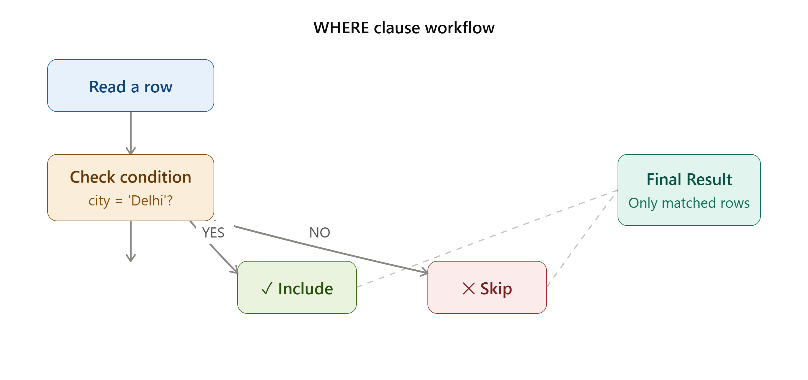
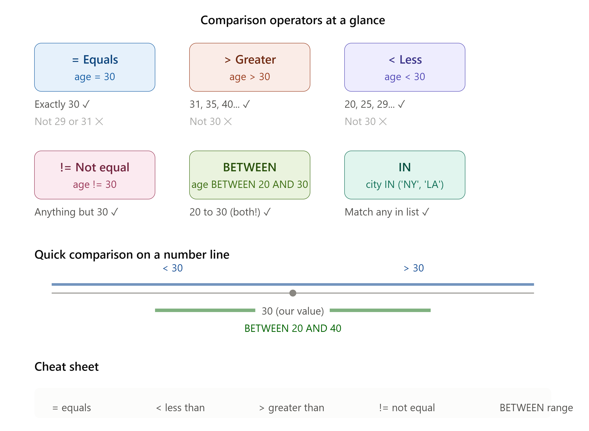
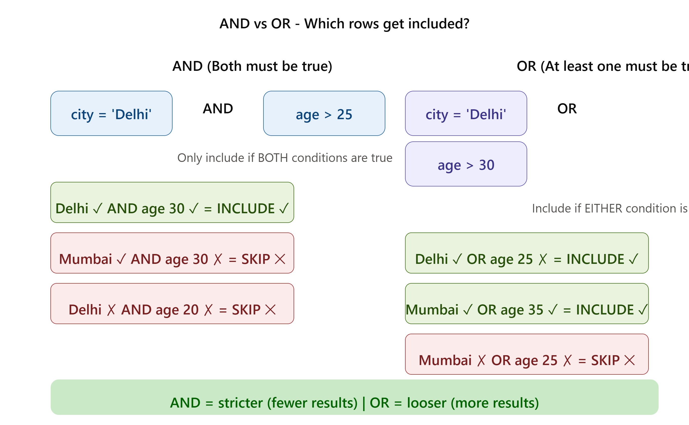
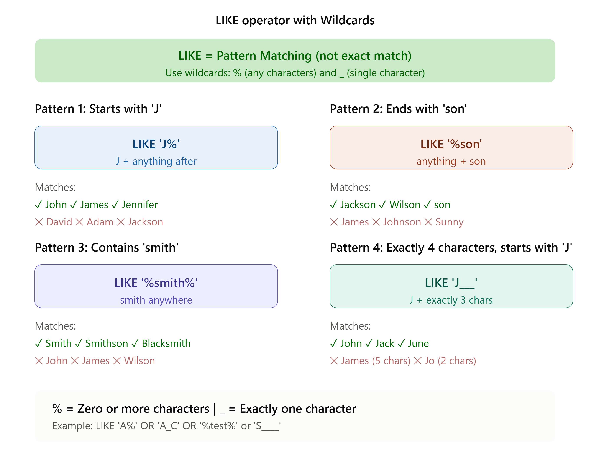
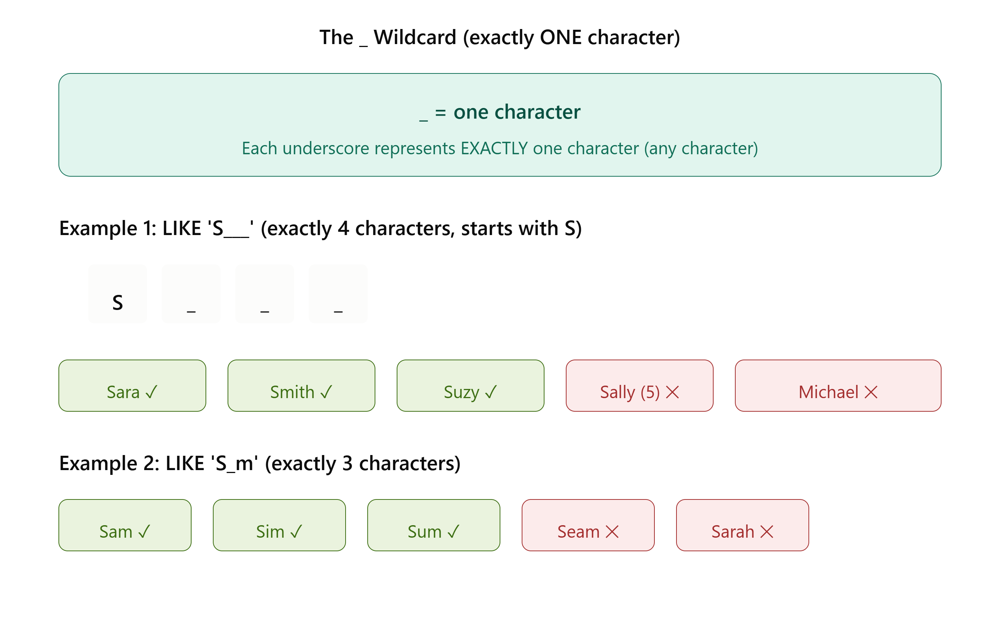
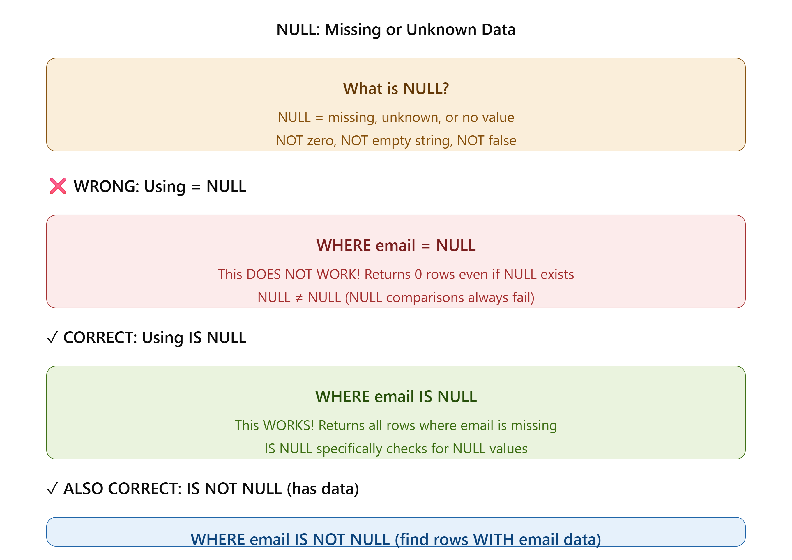
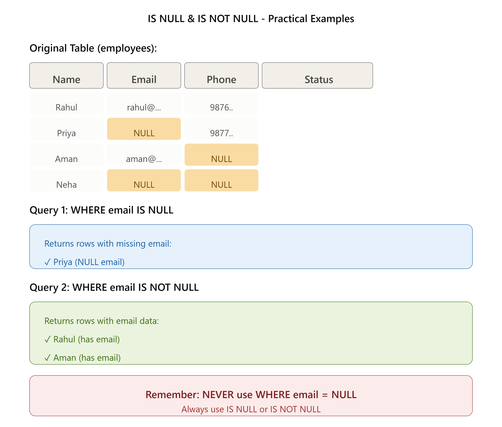

# 🔍 SQL PHASE 2: WHERE CLAUSE - COMPLETE

---

## 🗄️ What is the WHERE Clause?

### 📖 Simple Definition

> **WHERE clause filters data to get exactly what you need. It's like saying "Show me data, BUT ONLY IF these conditions are true."**

SQL reads every row and asks: "Does this row match my condition?" 
- If **YES** → Include in results
- If **NO** → Skip this row

---

## 💡 Why Learn WHERE Clause?

- ✅ **Retrieve specific data** - Not all data, just what you need
- ✅ **Faster queries** - Filter early, work with less data
- ✅ **Real analysis** - Most queries need filtering
- ✅ **Decision making** - Find specific customers, orders, products
- ✅ **Data quality** - Find missing or invalid data

---

## 🧠 How WHERE Works (Step by Step)

Think of WHERE like a **security checkpoint**:

```
Database Table
    ↓
SQL reads Row 1 → Check condition → Match? YES → Include ✅
    ↓
SQL reads Row 2 → Check condition → Match? NO → Skip ❌
    ↓
SQL reads Row 3 → Check condition → Match? YES → Include ✅
    ↓
... (repeat for all rows)
    ↓
Return only matching rows
```

### Visual Example:

**Original Table:**
```
| id | name     | age | city        |
|----|----------|-----|-------------|
| 1  | Rahul    | 28  | Delhi       |
| 2  | Priya    | 32  | Mumbai      |
| 3  | Aman     | 25  | Bangalore   |
| 4  | Neha     | 35  | Delhi       |
| 5  | Rohan    | 29  | Mumbai      |
```

**Query:**
```sql
SELECT * FROM employees WHERE city = 'Delhi';
```

**What happens:**
- Row 1: city = 'Delhi'? YES ✅ → Include
- Row 2: city = 'Delhi'? NO ❌ → Skip
- Row 3: city = 'Delhi'? NO ❌ → Skip
- Row 4: city = 'Delhi'? YES ✅ → Include
- Row 5: city = 'Delhi'? NO ❌ → Skip

**Result:**
```
| id | name     | age | city   |
|----|----------|-----|--------|
| 1  | Rahul    | 28  | Delhi  |
| 4  | Neha     | 35  | Delhi  |
```

---

## 📌 Basic Syntax

```sql
SELECT column_names 
FROM table_name 
WHERE condition;
```

**Breaking it down:**
- `SELECT` - Which columns to show
- `FROM` - Which table to read
- `WHERE` - Which rows to include (condition goes here)
- `;` - End of query

---


---

# 🔗 Comparison Operators(The Symbols)

| Symbol | Meaning | Example |
|--------|---------|---------|
| `=` | equals | `age = 20` |
| `<` | less than | `age < 22` |
| `>` | greater than | `age > 20` |
| `<=` | less than or equal | `age <= 20` |
| `>=` | greater than or equal | `age >= 20` |
| `!=` or `<>` | NOT equal | `city != 'Delhi'` |

---
Comparison operators compare two values and return **TRUE** or **FALSE**.

### 1️⃣ Equals (=)

**Syntax:** `column = value`

**Meaning:** Find rows where column EXACTLY matches value

```sql
-- Find customers from New York
SELECT * FROM customers WHERE city = 'New York';

-- Find employee with ID 5
SELECT * FROM employees WHERE emp_id = 5;
```

**Output Example:**
```
With WHERE city = 'New York':
Shows only customers from New York
New York, New York, New York ✅
Chicago, Los Angeles ❌
```

---

### 2️⃣ Greater Than (>)

**Syntax:** `column > value`

**Meaning:** Find rows where column is BIGGER than value

```sql
-- Find employees over 30 years old
SELECT * FROM employees WHERE age > 30;
-- Returns: 31, 32, 35, 40... (not 30, not 29)

-- Find products priced over $50
SELECT * FROM products WHERE price > 50;
```

**Example:**
```
age > 30:
Age 35 ✅  Age 30 ❌  Age 29 ❌
```

---

### 3️⃣ Less Than (<)

**Syntax:** `column < value`

**Meaning:** Find rows where column is SMALLER than value

```sql
-- Find orders under $100
SELECT * FROM orders WHERE amount < 100;
-- Returns: 50, 75, 99... (not 100, not 101)

-- Find employees under 25 years old
SELECT * FROM employees WHERE age < 25;
-- Returns: 20, 22, 24... (not 25, not 26)
```

**Example:**
```
age < 25:
Age 24 ✅  Age 25 ❌  Age 26 ❌
```

---

### 4️⃣ Greater Than or Equal (>=)

**Syntax:** `column >= value`

**Meaning:** Find rows where column is BIGGER or SAME as value

```sql
-- Find orders worth $100 or more.
SELECT * FROM orders WHERE amount >= 100;
-- Returns: 100, 101, 150, 200...

-- Find employees 30 years old or older
SELECT * FROM employees WHERE age >= 30;
-- Returns: 30, 31, 35, 40...

```

**Example:**
```
age >= 30:
Age 30 ✅  Age 35 ✅  Age 29 ❌
```

---

### 5️⃣ Less Than or Equal (<=)

**Syntax:** `column <= value`

**Meaning:** Find rows where column is SMALLER or SAME as value

```sql
-- Find orders $100 or less
SELECT * FROM orders WHERE amount <= 100;
-- Returns: 50, 75, 100 (includes 100!)

-- Find employees 30 years old or younger
SELECT * FROM employees WHERE age <= 30;
-- Returns: 20, 25, 30 (includes 30!)

```

**Example:**
```
age <= 30:
Age 30 ✅  Age 29 ✅  Age 31 ❌
```

---

### 6️⃣ Not Equal (!= or <>)

**Syntax:** `column != value` OR `column <> value`

**Meaning:** Find rows where column is NOT equal to value

```sql
-- Find employees NOT from New York
SELECT * FROM employees WHERE city != 'New York';

-- Find products that are NOT shoes
SELECT * FROM products WHERE category != 'shoes';
```

**Example:**
```
city != 'New York':
Delhi ✅  Mumbai ✅  New York ❌
```

---

### 7️⃣ BETWEEN (Range)

**Syntax:** `column BETWEEN value1 AND value2`

**Meaning:** Find rows where column is BETWEEN two values (inclusive)

```sql
-- Find orders between $100 and $500
SELECT * FROM orders WHERE amount BETWEEN 100 AND 500;
-- Returns: 100, 150, 200, 500 (includes both!)

-- Find employees aged 25 to 35
SELECT * FROM employees WHERE age BETWEEN 25 AND 35;
-- Returns: 25, 30, 35 (includes both!)

```

**Example:**
```
age BETWEEN 25 AND 35:
Age 25 ✅  Age 30 ✅  Age 35 ✅
Age 24 ❌  Age 36 ❌
```

**Shorthand:**
```sql
-- These are the same:
WHERE age BETWEEN 25 AND 35
WHERE age >= 25 AND age <= 35
```

---

### 8️⃣ IN (Multiple Values)

**Syntax:** `column IN (value1, value2, value3, ...)`

**Meaning:** Find rows where column matches ANY value in the list

```sql
-- Find customers from NY, LA, or Chicago
SELECT * FROM customers WHERE city IN ('New York', 'Los Angeles', 'Chicago');

-- Find employees in departments IT, HR, or Finance
SELECT * FROM employees WHERE department IN ('IT', 'HR', 'Finance');
```

**Example:**
```
city IN ('NY', 'LA', 'Chicago'):
New York ✅  Los Angeles ✅  Chicago ✅
Denver ❌  Boston ❌
```

**Shorthand:**
```sql
-- These are the same:
WHERE city IN ('NY', 'LA', 'Chicago')
WHERE city = 'NY' OR city = 'LA' OR city = 'Chicago'
```

---


---

### 📊 Comparison Operators Summary Table

| Operator | Meaning | Example | Includes | Excludes |
|----------|---------|---------|----------|----------|
| `=` | Equals | age = 30 | 30 | 29, 31 |
| `>` | Greater | age > 30 | 31, 32, 40 | 30, 29 |
| `<` | Less | age < 30 | 29, 28, 20 | 30, 31 |
| `>=` | Greater or equal | age >= 30 | 30, 31, 40 | 29, 28 |
| `<=` | Less or equal | age <= 30 | 30, 29, 20 | 31, 32 |
| `!=` or `<>` | Not equal | age != 30 | 29, 31, 40 | 30 |
| `BETWEEN` | Range | age BETWEEN 20 AND 30 | 20, 25, 30 | 19, 31 |
| `IN` | In list | age IN (20, 30) | 20, 30 | 25, 29 |

---

# 🧩 Logical Operators (AND, OR, NOT)

Logical operators let you **combine multiple conditions**.

### 1️⃣ AND Operator

**Syntax:** `condition1 AND condition2`

**Meaning:** Both conditions must be TRUE

```sql
-- Find employees in IT department AND salary > 50000
SELECT * FROM employees 
WHERE department = 'IT' AND salary > 50000;
-- Must be IT AND must earn more than 50000

-- Find customers from New York AND age > 25
SELECT * FROM customers 
WHERE city = 'New York' AND age > 25;
-- Must be from NY AND must be older than 25
```

**Logic:**
```
Condition 1 (IT): YES ✅  NO ❌  YES ✅  NO ❌
Condition 2 (>50k): YES ✅  YES ✅  NO ❌  NO ❌
Result: YES ✅  NO ❌  NO ❌  NO ❌
        (Both true) (At least one false)
```

**Real Example:**
```
Name | Dept | Salary | Result
Rahul | IT | 60000 | Include ✅ (IT AND >50k)
Priya | HR | 60000 | Skip ❌ (HR AND >50k - first condition false)
Aman | IT | 40000 | Skip ❌ (IT AND not >50k - second condition false)
```

---

### 2️⃣ OR Operator

**Syntax:** `condition1 OR condition2`

**Meaning:** At least ONE condition must be TRUE

```sql
-- Find customers from New York OR Los Angeles
SELECT * FROM customers 
WHERE city = 'New York' OR city = 'Los Angeles';
-- Include if from NY OR from LA (or both!)

-- Find employees in IT OR Finance department
SELECT * FROM employees 
WHERE department = 'IT' OR department = 'Finance';
-- Include if IT OR Finance (or both!)
```

**Logic:**
```
Condition 1: YES ✅  NO ❌  YES ✅  NO ❌
Condition 2: YES ✅  YES ✅  NO ❌  NO ❌
Result: YES ✅  YES ✅  YES ✅  NO ❌
        (At least one true)
```

**Real Example:**
```
City | Department | Result
New York | IT | Include ✅ (NY OR LA - first true)
Los Angeles | HR | Include ✅ (NY OR LA - second true)
Chicago | Finance | Skip ❌ (Not NY, not LA)
New York | Finance | Include ✅ (NY OR LA - first true)
```

---

### 3️⃣ NOT Operator

**Syntax:** `NOT condition`

**Meaning:** Opposite of the condition

```sql
-- Find employees NOT from Delhi
SELECT * FROM employees WHERE NOT city = 'Delhi';

-- Find orders NOT completed
SELECT * FROM orders WHERE NOT status = 'completed';

```

**Shorthand:**
```sql
-- These are the same:
WHERE NOT city = 'Delhi'
WHERE city != 'Delhi'

-- These are the same:
WHERE NOT age > 30
WHERE age <= 30
```

**Real Example:**
```
City = 'Delhi'? | NOT Result
YES ✅ | NO ❌ (Skip)
NO ❌ | YES ✅ (Include)
```

---

# 🔀 Combining AND, OR, NOT

You can combine multiple operators:

```sql
-- Find high-earning IT employees NOT in Delhi
SELECT * FROM employees 
WHERE department = 'IT' AND salary > 50000 AND NOT city = 'Delhi';

-- Find customers from NY or LA with age > 25
SELECT * FROM employees 
WHERE (city = 'New York' OR city = 'Los Angeles') AND age > 25;

-- Find orders that are NOT pending AND NOT cancelled
SELECT * FROM orders 
WHERE NOT status = 'pending' AND NOT status = 'cancelled';

```

---

# ⚙️ Operator Precedence (Order of Operations)

When you mix AND and OR, **AND executes first**!

```sql
-- Example: Find New York customers OR any customer over 60
SELECT * FROM customers 
WHERE city = 'New York' AND age > 25 OR age > 60;

-- Evaluated as:
WHERE (city = 'New York' AND age > 25) OR age > 60
-- Not: WHERE city = 'New York' AND (age > 25 OR age > 60)
```

**Always use parentheses to be clear!**

```sql
-- Confusing (AND has priority):
WHERE city = 'NY' AND age > 25 OR age > 60;

-- Clear (use parentheses):
WHERE (city = 'NY' AND age > 25) OR age > 60;
```
---


---

# 🔤 LIKE & Wildcards

**Pattern matching** instead of exact match.

### Basic LIKE

**Syntax:** `column LIKE pattern`

### Wildcards:
- **%** = Any number of characters
- **_** = Single character

```sql
-- Names starting with 'J'
SELECT * FROM customers WHERE name LIKE 'J%';
-- Returns: John, James, Jennifer, Jane

-- Names ending with 'son'
SELECT * FROM customers WHERE name LIKE '%son';
-- Returns: Johnson, Jackson, Wilson

-- Names containing 'smith'
SELECT * FROM customers WHERE name LIKE '%smith%';
-- Returns: Smith, Smithson, Blacksmith

-- Names exactly 5 characters, starting with 'S'
SELECT * FROM customers WHERE name LIKE 'S____';
-- Returns: Smith, Sunny, Sally (exactly 5 chars!)

-- Email addresses
SELECT * FROM users WHERE email LIKE '%@gmail.com';
-- Returns: john@gmail.com, jane@gmail.com
```

**Examples:**
```
Pattern: 'J%' matches: John, James, Jennifer, Japan
Pattern: '%son' matches: Johnson, Jackson, Wilson, season
Pattern: 'S____' matches: Sally (5 chars), Smith (5 chars)
```
---


---



---


# ❓ NULL Handling

### What is NULL?

**NULL** means the value is **missing** or **unknown**.

**Example:**

| Employee | Email |
|----------|-------------------|
| Rahul | rahul@gmail.com |
| Aman | NULL |

Aman's email is missing, so it is **NULL**.

---

## ✅ IS NULL

Use `IS NULL` to find **missing values**.

**Syntax:**

```sql
SELECT * FROM table_name
WHERE column_name IS NULL;
```

**Example:**

```sql
SELECT * FROM employees
WHERE email IS NULL;
```

---

## ✅ IS NOT NULL

Use `IS NOT NULL` to find **available values**.

**Syntax:**

```sql
SELECT * FROM table_name
WHERE column_name IS NOT NULL;
```

**Example:**

```sql
SELECT * FROM employees
WHERE email IS NOT NULL;
```

---

## ⚠️ Remember

❌ Wrong

```sql
SELECT * FROM employees
WHERE email = NULL;
```

✅ Correct

```sql
SELECT * FROM employees
WHERE email IS NULL;
```

**💡 Easy Tip:**

- `IS NULL` → Missing value
- `IS NOT NULL` → Value exists
----
---


---



---
## 📝 Quick Revision

### LIKE

```sql
LIKE 'A%'        → Starts with A
LIKE '%son'      → Ends with son
LIKE '%smith%'   → Contains "smith"
LIKE '____'      → Exactly 4 characters
LIKE 'S_m'       → Starts with S, ends with m (3 characters)
```

### NULL

```sql
IS NULL          → Find missing values
IS NOT NULL      → Find existing values
```

### Common Mistake

✅ Correct

```sql
WHERE email IS NULL
```

❌ Wrong

```sql
WHERE email = NULL
```

> **Remember:** Use `IS NULL`, **not** `= NULL`.
---

## 📚 Real-World Examples

### Example 1: Marketing Campaign

**Scenario:** Find customers from New York aged 25-35 for email campaign

```sql
SELECT customer_id, name, email, age 
FROM customers 
WHERE city = 'New York' 
  AND age BETWEEN 25 AND 35 
  AND email IS NOT NULL;
```

**What this does:**
- From city = New York
- AND aged 25-35 (inclusive)
- AND have email address
- Returns: Only those matching ALL conditions

---

### Example 2: Financial Analysis

**Scenario:** Find orders over $1000 from last 3 months that aren't refunded

```sql
SELECT order_id, amount, customer_name 
FROM orders 
WHERE amount > 1000 
  AND order_date >= DATE_SUB(CURDATE(), INTERVAL 3 MONTH)
  AND status != 'refunded';
```

**What this does:**
- Orders over $1000
- From last 3 months
- That aren't refunded
- Returns: High-value recent orders

---

### Example 3: HR Department

**Scenario:** Find IT engineers making between $60k-$100k

```sql
SELECT name, salary, hire_date 
FROM employees 
WHERE department = 'IT' 
  AND job_title LIKE '%Engineer%'
  AND salary BETWEEN 60000 AND 100000;
```

**What this does:**
- From IT department
- Job title contains "Engineer"
- Salary $60k-$100k
- Returns: Target candidates

---

### Example 4: Sales Tracking

**Scenario:** Find customers from NY or LA who spent $500+

```sql
SELECT customer_name, total_spent, city 
FROM customers 
WHERE (city = 'New York' OR city = 'Los Angeles')
  AND total_spent >= 500;
```

**What this does:**
- From NY or LA
- Spent $500 or more
- Returns: High-value customers

---

### Example 5: Data Quality

**Scenario:** Find incomplete customer records (missing phone or email)

```sql
SELECT customer_id, name 
FROM customers 
WHERE phone IS NULL 
  OR email IS NULL;
```

**What this does:**
- Missing phone number
- OR missing email
- Returns: Incomplete records

---

## 🚨 Common Mistakes

### ❌ Mistake 1: Using = with NULL

**Wrong:**
```sql
SELECT * FROM customers WHERE email = NULL;
```

**Why:** NULL comparisons don't work with =

**Correct:**
```sql
SELECT * FROM customers WHERE email IS NULL;
```

---

### ❌ Mistake 2: Forgetting Parentheses

**Wrong (confusing):**
```sql
SELECT * FROM customers 
WHERE age > 25 OR age < 20 AND city = 'NY';
-- Evaluated as: age > 25 OR (age < 20 AND city = 'NY')
```

**Correct (clear):**
```sql
SELECT * FROM customers 
WHERE (age > 25 OR age < 20) AND city = 'NY';
```

---

### ❌ Mistake 3: Wrong AND vs OR

**Wrong (wants either city):
```sql
SELECT * FROM customers WHERE city = 'NY' AND city = 'LA';
-- Can't be both NY and LA at same time!
```

**Correct:**
```sql
SELECT * FROM customers WHERE city = 'NY' OR city = 'LA';
```

---

### ❌ Mistake 4: LIKE Case Sensitivity

**Note:** LIKE is usually case-INSENSITIVE (depends on database)

```sql
WHERE name LIKE 'john%';  -- Matches John, JOHN, john
```

---

### ❌ Mistake 5: BETWEEN Confusion

**Correct:**
```sql
WHERE age BETWEEN 20 AND 30;
-- Includes 20, 25, 30 (both endpoints!)
```

---

### ❌ Mistake 6: Not Quoting Text

**Wrong:**
```sql
WHERE city = New York;  -- Error!
```

**Correct:**
```sql
WHERE city = 'New York';  -- Quotes required
```

---

### ❌ Mistake 7: Combining Conditions Wrong

**Wrong:**
```sql
SELECT * FROM orders 
WHERE amount > 100, status = 'completed';
```

**Correct:**
```sql
SELECT * FROM orders 
WHERE amount > 100 AND status = 'completed';
```

---

### ❌ Mistake 8: IN with Wrong Syntax

**Wrong:**
```sql
WHERE city IN 'NY', 'LA', 'Chicago';  -- Wrong syntax
```

**Correct:**
```sql
WHERE city IN ('NY', 'LA', 'Chicago');  -- With parentheses
```

---

### ❌ Mistake 9: NOT in Wrong Place

**Wrong:**
```sql
SELECT * FROM customers WHERE NOT;  -- Incomplete
```

**Correct:**
```sql
SELECT * FROM customers WHERE NOT city = 'NY';
```

---

### ❌ Mistake 10: Comparing Different Types

**Wrong:**
```sql
WHERE age = '30';  -- Comparing number to text (might work, but bad)
```

**Correct:**
```sql
WHERE age = 30;  -- Same type
```
---

**Explanation:**
- (city = 'NY' OR city = 'LA') → From either city
- AND age > 25 → Older than 25
- AND email IS NOT NULL → Email exists
- All three conditions must be true
- Parentheses make order clear

---

## 🎓 KEY POINTS TO REMEMBER

| Point | Details |
|-------|---------|
| **WHERE filters** | Shows only matching rows |
| **= vs !=** | = means exact match, != means opposite |
| **> vs >=** | > doesn't include value, >= does |
| **AND** | Both conditions must be true |
| **OR** | At least one condition must be true |
| **NOT** | Opposite of condition |
| **BETWEEN** | Inclusive (includes both boundaries) |
| **IN** | Matches any value in list |
| **LIKE %** | Wildcard for any characters |
| **IS NULL** | Use for missing data (not =) |
| **Precedence** | AND before OR (use parentheses!) |
| **Parentheses** | Always use for clarity |

---


## 🎯 CHECKLIST: Are You Ready?

Before moving to next topic, can you:

- [ ] Explain what WHERE clause does
- [ ] Use all 8 comparison operators (=, <, >, !=, >=, <=, BETWEEN, IN)
- [ ] Combine conditions with AND
- [ ] Combine conditions with OR
- [ ] Use NOT operator
- [ ] Use LIKE with wildcards
- [ ] Handle NULL values with IS NULL
- [ ] Use parentheses for clarity
- [ ] Write comments explaining conditions
- [ ] Complete all practice exercises
- [ ] Solve all challenge problems
- [ ] Explain operator precedence

**If YES to all → Ready for next phase! 🚀**

---


## 💬 FINAL REMINDER

> **WHERE is the gatekeeper. Use it to get exactly the data you need, no more, no less.**

---

**Congratulations! You've completed Phase 2: WHERE Clause! 🎉**

You now understand:
- ✅ All comparison operators
- ✅ Logical operators (AND, OR, NOT)
- ✅ BETWEEN and IN
- ✅ LIKE and wildcards
- ✅ NULL handling
- ✅ Real-world applications
- ✅ Common mistakes to avoid

**Ready for Phase 3? Let's keep learning! 🚀**