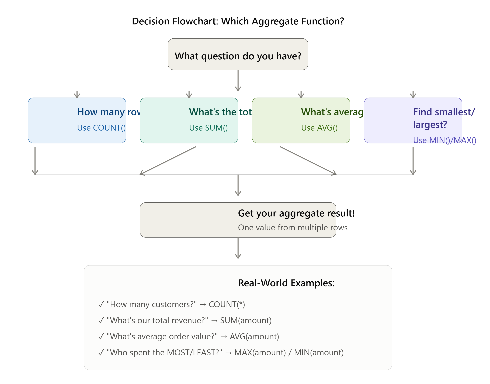
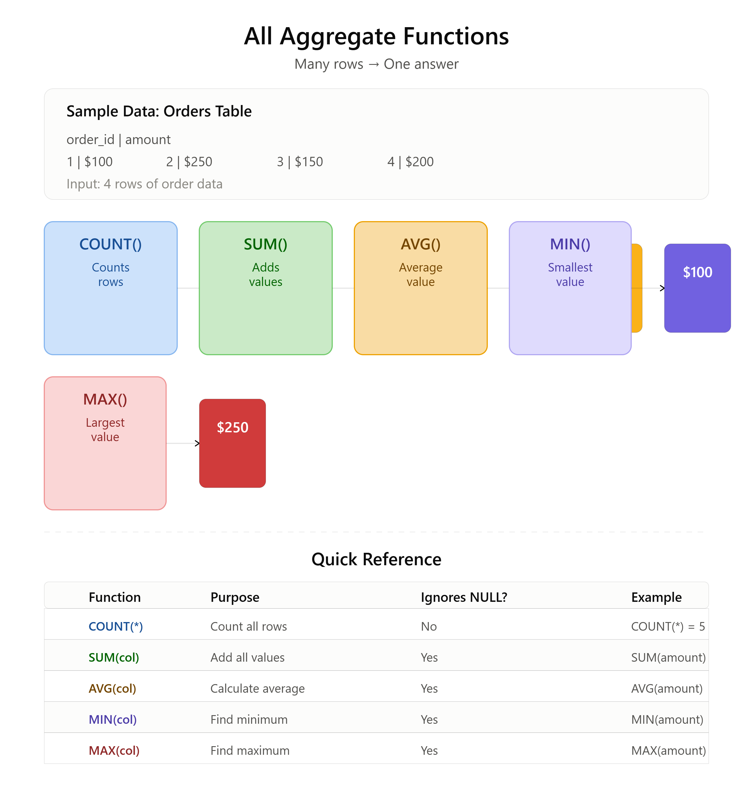
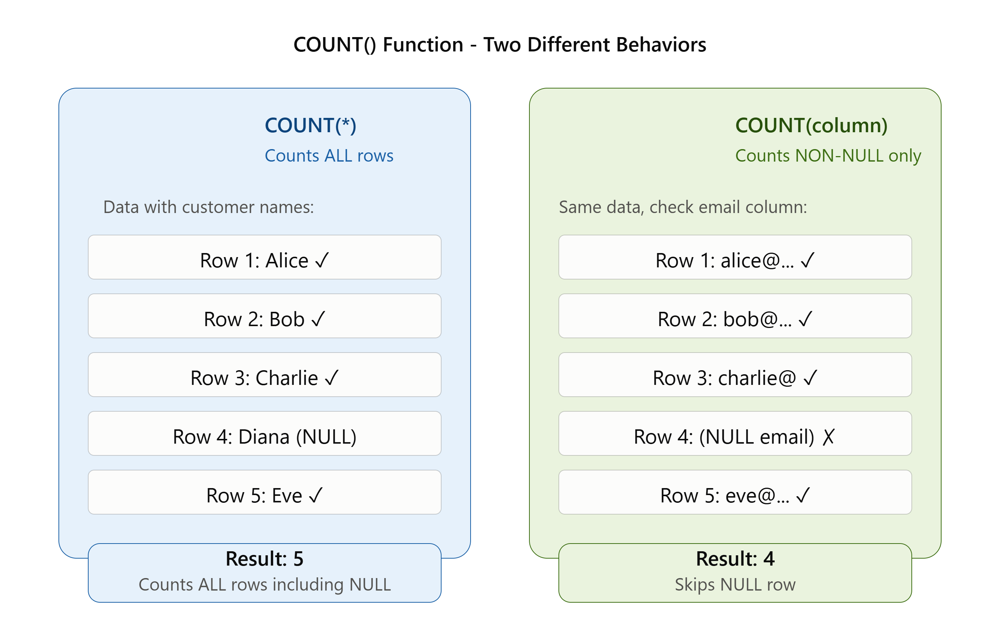
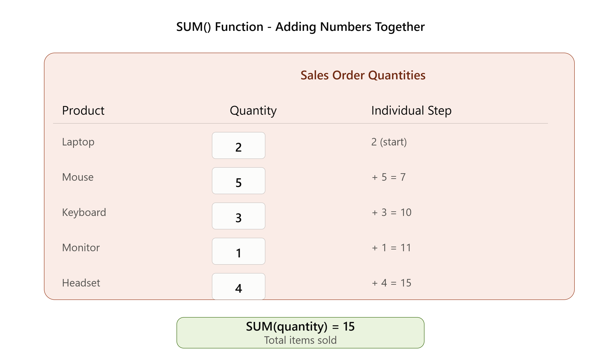
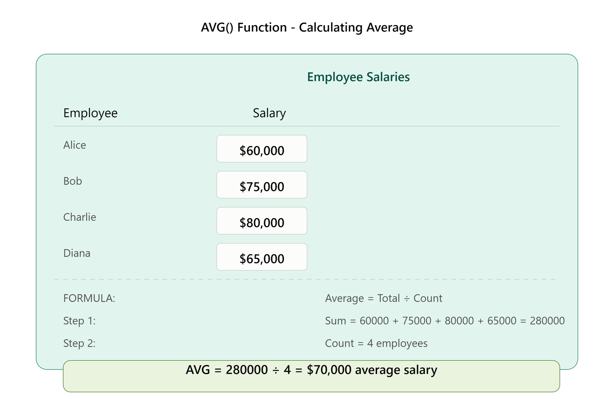
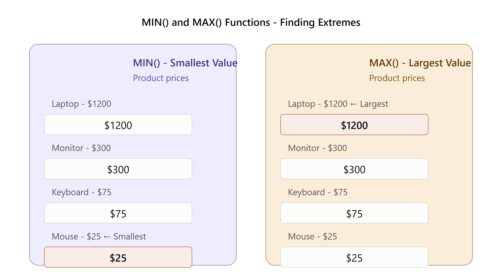

# 📚 AGGREGATE FUNCTIONS: THE ULTIMATE CRASH COURSE 

---

## SECTION 0: YOUR FIRST QUERY IN 10 SECONDS

**Before we talk, let's just do it.** 

Imagine a table called `employees` with 6 salaries. If you run this:

```sql
SELECT 
    COUNT(*) AS total_staff,
    SUM(salary) AS total_payroll,
    ROUND(AVG(salary), 2) AS avg_pay
FROM employees;
```

**It turns 6 messy rows into this crystal-clear answer:**

| total_staff | total_payroll | avg_pay |
| :--- | :--- | :--- |
| **6** | **$305,000** | **$50,833.33** |

That is the *magic* of Aggregate Functions. **They shrink mountains of data into a single snapshot.** Now, let's learn the 5 tools that did that.

---

## SECTION 1: THE 5 SUPERPOWERS (THE TOOLS)

| Icon | Function | The 5-Word Job Description | Business Question |
| :--- | :--- | :--- | :--- |
| 🔢 | **`COUNT()`** | *"How many rows exist?"* | "How many customers?" |
| ➕ | **`SUM()`** | *"Add up all numbers."* | "What were total sales?" |
| ⚖️ | **`AVG()`** | *"Find the balancing point."* | "What's the typical order?" |
| ⬇️ | **`MIN()`** | *"Dig up the smallest."* | "What's the cheapest item?" |
| ⬆️ | **`MAX()`** | *"Reach for the largest."* | "What's the top salary?" |



---

## SECTION 2: YOUR DATA PLAYGROUND (COPY THIS!)

To learn, you need to *touch* data. Copy and paste this entire block into your SQL tool right now:

```sql
-- Create the table
CREATE TABLE employees (
    emp_id INT,
    name VARCHAR(50),
    salary DECIMAL(10,2)
);

-- Insert the exact data we use in all examples below
INSERT INTO employees VALUES 
(1, 'Rahul', 50000),
(2, 'Aman', 45000),
(3, 'Neha', NULL),   -- <-- Look! Unknown salary
(4, 'Priya', 55000),
(5, 'Ravi', 45000),
(6, 'Mohit', NULL);  -- <-- Look! Unknown salary
```

**Now, whenever you see a code block below, type it in and watch what happens!**
---

## SECTION 3: 🧨 THE #1 GOLDEN RULE (NULL = "SKIP IT")

**This single rule determines 90% of your results.** 

`NULL` = **Unknown**. It is **not** zero (0). It is **not** a space. 

**👉 When SQL sees a `NULL`, it does NOT panic. It simply SKIPS that value and moves to the next row.**

Here is what SQL's "eyes" see when it looks at our `salary` column:

```
Row 1: 50,000  → "I see a number. Keep it."
Row 2: 45,000  → "I see a number. Keep it."
Row 3: [NULL]  → "I see nothing. SKIP IT."  ❌
Row 4: 55,000  → "I see a number. Keep it."
Row 5: 45,000  → "I see a number. Keep it."
Row 6: [NULL]  → "I see nothing. SKIP IT."  ❌
```

**The Consequence:** 
`SUM()` and `AVG()` only do math on the **4 known numbers** (50+45+55+45). They completely ignore rows 3 and 6. **Memorize this before reading the next sections.**

---
# ⚠️ THE 6 DEADLY BEGINNER MISTAKES (READ BEFORE WRITING SQL)

** stick it on your wall. These 6 errors cause 95% of all beginner SQL bugs.**

| ❌ The Mistake | 💀 Why SQL Crashes | ✅ The Fix |
| :--- | :--- | :--- |
| **1. Treating NULL like zero** | `AVG()` skips NULLs, so your average is higher than expected. | Remember: **NULL = "Skip it"**, not "0". |
| **2. Using `COUNT(salary)` when you want total staff** | If 2 people have NULL salary, `COUNT(salary)` returns 4, not 6. | Use **`COUNT(*)`** for total rows. |
| **3. Putting aggregates in `WHERE`** | `WHERE SUM(salary) > 100000` → **ERROR!** WHERE runs *before* the math. | Use **`HAVING`** for filtering after math. |
| **4. Using `SUM()` on text or dates** | `SELECT SUM(name)` → **ERROR!** You can't add words. | Only use `SUM()`/`AVG()` on **numeric** columns. |
| **5. Forgetting to `ROUND()` your averages** | `AVG(salary)` → `50833.333333` (ugly!) | Wrap it: **`ROUND(AVG(salary), 2)`**. |
| **6. Using `SUM()` when you need `COUNT()`** | *"How many orders?"* → `SUM(order_id)` adds IDs (nonsense!). | Use **`COUNT(*)`** to count rows. |

---

## 🧠 The 2-Second Memory Trick:

> **"If it's math, it must be a number. If it's counting, use star (*). If it's filtering after math, use HAVING."**

Write that on a sticky note. You'll thank me later.

---
## SECTION 4: `COUNT()` – THE COUNTER

**Template:**
```sql
SELECT COUNT(column_name) FROM table_name;
```

**The Two Personalities:**

| Code | What SQL Does | When to Use |
| :--- | :--- | :--- |
| `SELECT COUNT(*)` | Counts **ALL rows**, even if they are fully empty. | *"Total staff headcount."* |
| `SELECT COUNT(salary)` | Counts rows **only if salary has a real number**. | *"How many salaries did we actually enter?"* |


**👉 Run these on your new data:**

```sql
SELECT COUNT(*) FROM employees;  
-- Result: 6 (Because there are 6 staff records)

SELECT COUNT(salary) FROM employees;  
-- Result: 4 (Because Neha and Mohit have NULL)
```

---

## SECTION 5: `SUM()` – THE ADDER

**Template:**
```sql
SELECT SUM(column_name) FROM table_name;
```

**What it does:** Adds only the numbers it can *see* (skips NULLs).

**👉 Run this:**

```sql
SELECT SUM(salary) FROM employees;
```

**SQL's internal math:**
```
50,000 + 45,000 + 55,000 + 45,000 = 195,000
(Neha and Mohit? SQL waved goodbye to them because they were NULL).
→ Result: 195,000
```


**⚠️ CRITICAL WARNING:** 
`SUM()` is **Numbers ONLY**. 
- ❌ `SELECT SUM(name)` → **ERROR** (you can't add words together).

---

## SECTION 6: `AVG()` – THE BALANCER (THE TRAP IS HERE)

**Template:**
```sql
SELECT ROUND(AVG(column_name), 2) FROM table_name;
```
*(Always wrap AVG in `ROUND` to avoid ugly decimals!)*

**👉 Run this on your data:**

```sql
SELECT ROUND(AVG(salary), 2) FROM employees;
```

**⚰️ THE TRAP REVEALED (Read this slowly):**

Most beginners think: *"There are 6 employees. I will divide by 6."* 

**❌ Wrong Beginner Math:**
```
(50,000 + 45,000 + 0 + 55,000 + 45,000 + 0) ÷ 6 = 32,500
```

**✅ SQL's Actual Math (The Right Way):**
```
Step 1: Add known numbers: 50,000 + 45,000 + 55,000 + 45,000 = 195,000
Step 2: Count how many numbers we actually added: 4 (not 6!)
Step 3: Divide: 195,000 ÷ 4 = 48,750
→ Result: 48,750
```

> **🚀 Rule to tattoo on your brain:** `AVG()` = Sum of **Known** Values ÷ Count of **Known** Values. NULLs are ghosts. They vanish before the math starts.

---

## SECTION 7: `MIN()` & `MAX()` – THE EXTREMES

**Template:**
```sql
SELECT MIN(column_name) FROM table_name;
SELECT MAX(column_name) FROM table_name;
```

**What they do:** 
- `MIN()` finds the absolute **smallest / lowest / oldest**.
- `MAX()` finds the absolute **largest / highest / newest**.

**👉 Run these on your numbers:**

```sql
SELECT MIN(salary) FROM employees;  -- Result: 45,000 (Rahul's 50k, but Ravi/Aman have 45k)
SELECT MAX(salary) FROM employees;  -- Result: 55,000 (Priya wins)
```

**🤯 Mind-Blowing Extension (MIN/MAX work on words and dates too!):**

| Data Type | Code | Result |
| :--- | :--- | :--- |
| **Text** | `SELECT MIN(product_name) FROM products;` | Alphabetically **First** (e.g., "Apple") |
| **Text** | `SELECT MAX(product_name) FROM products;` | Alphabetically **Last** (e.g., "Zebra") |
| **Dates** | `SELECT MIN(hire_date) FROM employees;` | **Oldest** hire date (e.g., 2010-01-01) |
| **Dates** | `SELECT MAX(hire_date) FROM employees;` | **Newest** hire date (e.g., 2025-06-01) |
---


---

## SECTION 8: `COUNT(DISTINCT)` – THE DUPLICATE DESTROYER

**Template:**
```sql
SELECT COUNT(DISTINCT column_name) FROM table_name;
```

**What it does:** Counts only the **unique / different** values. If a value appears 100 times, it counts it as *just 1*.

**The Scenario:** 
Your company has 6 employees, but they work in only 3 different departments (Sales, IT, HR). 

| Question | Code | Result |
| :--- | :--- | :--- |
| *"How many total employees?"* | `SELECT COUNT(*) FROM employees;` | 6 |
| *"How many **different** departments?"* | `SELECT COUNT(DISTINCT department) FROM employees;` | 3 |

**When to use it daily:**
- *"How many unique products did we sell?"*
- *"How many distinct countries do our customers live in?"*
- *"How many unique zip codes are in this city?"*

---

## 📋 THE STICKY-NOTE CHEATSHEET (SECTIONS 0–8)

Pin this to your monitor:

| You Want... | Write This... | Remember... |
| :--- | :--- | :--- |
| Total Rows | `SELECT COUNT(*) FROM t;` | Counts **everything**. |
| Total Value | `SELECT SUM(col) FROM t;` | **Numbers only.** Skips NULLs. |
| Average Value | `SELECT ROUND(AVG(col),2) FROM t;` | Skips NULLs in **count**! |
| Smallest/Oldest | `SELECT MIN(col) FROM t;` | Works on numbers, dates, AND text. |
| Largest/Newest | `SELECT MAX(col) FROM t;` | Works on numbers, dates, AND text. |
| Unique Count | `SELECT COUNT(DISTINCT col) FROM t;` | Kills duplicates. |

---

# 🚀 AGGREGATE FUNCTIONS: THE ADVANCED PLAYBOOK (SECTIONS 9–25)

---

## SECTION 9: COMBINING ALL FUNCTIONS (THE "ALL-IN-ONE" QUERY)

You don't have to run 5 separate queries. You can ask for **everything** in a single line of code. 

**The Ultimate Snapshot:**
```sql
SELECT 
    COUNT(*) AS total_staff,
    SUM(salary) AS total_payroll,
    ROUND(AVG(salary), 2) AS avg_salary,
    MIN(salary) AS entry_level,
    MAX(salary) AS top_earner,
    COUNT(DISTINCT department) AS total_depts
FROM employees;
```

**What you get in one glance:**
| total_staff | total_payroll | avg_salary | entry_level | top_earner | total_depts |
| :--- | :--- | :--- | :--- | :--- | :--- |
| 6 | $305,000 | $50,833.33 | $40,000 | $70,000 | 3 |

> **💡 Pro Tip:** The `AS` keyword (aliasing) is your best friend. It turns ugly column names like `COUNT(*)` into beautiful labels like `total_staff`.

---

## SECTION 10: THE `WHERE` + AGGREGATE COMBO (FILTER FIRST)

**Golden Rule:** `WHERE` happens **BEFORE** the math. 

**This is the execution order in SQL's brain:**
```
1️⃣ WHERE clause runs → Filters out unwanted rows.
2️⃣ Then Aggregates (SUM/AVG/COUNT) run → Does math only on the survivors.
```

**Real Code Example:**
```sql
-- We want the average salary, but ONLY for the Sales department.
SELECT ROUND(AVG(salary), 2) AS sales_avg
FROM employees
WHERE department = 'Sales';
```
*(SQL first grabs only Sales employees, then calculates the average on that smaller group).*

**When to use WHERE with Aggregates:**
- *"Total revenue from **January** only."* → `WHERE MONTH(date) = 1`
- *"Average price of products **over $50**."* → `WHERE price > 50`
- *"Count of orders for **customer #5**."* → `WHERE customer_id = 5`

---

## 🚨 SECTION 11: THE "WHERE vs HAVING" NUCLEAR TRAP

**This is the #1 error in SQL. Read this timeline carefully.**

**❌ The Mistake:** Trying to filter *based on the math*.
```sql
-- You want: "Show me departments where the total payroll is over $100,000"
-- WRONG CODE:
SELECT department, SUM(salary)
FROM employees
WHERE SUM(salary) > 100000;  -- ❌ BOOM! ERROR!
```

**Why it crashes:**
```
SQL's Brain:
Step 1: "Let me check the WHERE clause... oh wait, I haven't added up the 
        salaries yet! I don't know what the SUM is! I quit." → ERROR
```

**✅ The Fix:** If you need to filter *after* doing the math, you use `HAVING` (not `WHERE`).

```sql
-- CORRECT CODE:
SELECT department, SUM(salary) AS total_payroll
FROM employees
GROUP BY department
HAVING SUM(salary) > 100000;  -- ✅ Works perfectly!
```

| Keyword | When It Runs | What It Filters |
| :--- | :--- | :--- |
| **`WHERE`** | **Before** the math | Filters individual rows (e.g., "Sales department only"). |
| **`HAVING`** | **After** the math | Filters the final answers (e.g., "Only show totals over $100k"). |

---

## SECTION 12: THE 5 DEADLY SYNTAX MISTAKES (AND FIXES)

| ❌ The Mistake | 💀 Why It Breaks | ✅ The Fix |
| :--- | :--- | :--- |
| `SELECT SUM(name)` | You can't add words together. | Use it on a **number** column. |
| `WHERE COUNT(*) > 5` | WHERE runs *before* the count exists. | Move it to `HAVING`. |
| `SELECT COUNT(salary)` expecting 6 rows | You forgot NULLs are skipped. | Use `COUNT(*)` for total rows. |
| `SELECT AVG(salary)` and getting 50,833.333333 | You forgot to round it. | Wrap it: `ROUND(AVG(salary), 2)`. |
| `SELECT COUNT(DISTINCT *)` | You can't use `*` with `DISTINCT`. | Specify a column: `COUNT(DISTINCT id)`. |

---

## SECTION 13: THE DATA TYPE RULE (What works on what?)

| Function | Numbers | Dates | Text |
| :--- | :--- | :--- | :--- |
| `COUNT(*)` / `COUNT(col)` | ✅ | ✅ | ✅ |
| `SUM()` / `AVG()` | ✅ | ❌ | ❌ |
| `MIN()` / `MAX()` | ✅ | ✅ (Oldest/Newest) | ✅ (Alphabetical) |

**The Shortcut to memorize:**
> *"If it's adding or averaging, it must be a number. If it's finding extremes (MIN/MAX) or counting, it works on everything."*

---

## SECTION 14: THE EMERGENCY ROOM (FAQ + TROUBLESHOOTING)

*Fast answers to the questions that make beginners panic.*

**Q: My AVG is returning `NULL`! Why?**
**A:** All values in your column are `NULL`. SQL can't divide by zero, so it gives up and returns `NULL`. 
**Fix:** Use `SELECT COALESCE(AVG(col), 0)` to show `0` instead.

---

**Q: My SUM returned `NULL`, not `0`. Why?**
**A:** Same reason. If every row is `NULL`, the total is "unknown" (`NULL`). 
**Fix:** `SELECT COALESCE(SUM(col), 0)` to turn it into a clean `0`.

---

**Q: How do I count NULLs specifically?**
**A:** You can't directly, but here's the trick:
```sql
SELECT COUNT(*) - COUNT(salary) AS null_count
FROM employees;
```

---

**Q: Can I use `MIN()` and `MAX()` on the same column in one query?**
**A:** Absolutely.
```sql
SELECT MIN(price) AS cheapest, MAX(price) AS most_expensive
FROM products;
```

---

## SECTION 15: REAL-WORLD BUSINESS REPORT TEMPLATES

**Template 1: Daily Sales Dashboard (Coffee Shop)**
```sql
SELECT 
    DATE(order_date) AS day,
    COUNT(*) AS orders,
    SUM(total) AS revenue,
    ROUND(AVG(total), 2) AS avg_order_value,
    MIN(total) AS smallest_ticket,
    MAX(total) AS biggest_ticket
FROM sales
WHERE DATE(order_date) = CURDATE();
```

---

**Template 2: Inventory Health Check (E-Commerce)**
```sql
SELECT 
    COUNT(DISTINCT category) AS product_categories,
    SUM(stock_quantity) AS total_inventory,
    ROUND(AVG(price), 2) AS average_price,
    MIN(price) AS cheapest_item,
    MAX(price) AS premium_item
FROM products
WHERE status = 'active';
```

---

**Template 3: HR Payroll Summary**
```sql
SELECT 
    COUNT(*) AS total_staff,
    SUM(salary) AS monthly_payroll,
    ROUND(AVG(salary), 0) AS avg_salary,
    MAX(salary) - MIN(salary) AS pay_gap
FROM employees
WHERE status = 'active';
```
*(Notice the `pay_gap` calculation? You can do math on aggregate results!)*

---

## 🛠️ SECTION 16: PRACTICE ZONE (WITH AI STRATEGY)

**⚠️ How to practice without wasting tokens:**
- **Don't** paste your whole database schema into Claude.
- **Do** write your query in this scratchpad, run it in your SQL tool, and if it breaks, paste *only the error message* into Claude.

**Level 1 (Beginner):**
*Write a query to find the total number of products in your store.*

<details><summary>✅ Click for Answer</summary>

```sql
SELECT COUNT(*) FROM products;
```
</details>

---

**Level 2 (Intermediate):**
*Write a query that shows the total revenue, average order value, and number of orders for today only.*

<details><summary>✅ Click for Answer</summary>

```sql
SELECT 
    COUNT(*) AS total_orders,
    SUM(amount) AS revenue,
    ROUND(AVG(amount), 2) AS avg_order
FROM orders
WHERE DATE(order_date) = CURDATE();
```
</details>

---

**Level 3 (Hard):**
*Find the highest paid employee, the lowest paid employee, and the difference between them.*

<details><summary>✅ Click for Answer</summary>

```sql
SELECT 
    MAX(salary) AS highest,
    MIN(salary) AS lowest,
    (MAX(salary) - MIN(salary)) AS salary_gap
FROM employees;
```
</details>

---

## 📋 SECTION 17: THE ULTIMATE CHEATSHEET (SECTIONS 9–25)

```
═══════════════════════════════════════════════════════════════
                 ADVANCED AGGREGATE CHEATSHEET
═══════════════════════════════════════════════════════════════

FILTERING RULE:
┌──────────────────────────────────────────────────────────────┐
│  WHERE = Filter ROWS (before math)                          │
│  HAVING = Filter GROUPS (after math)                       │
│                                                             │
│  ✅ WHERE department = 'Sales'                             │
│  ✅ HAVING SUM(salary) > 100000                            │
│  ❌ WHERE SUM(salary) > 100000 (ERROR!)                    │
└──────────────────────────────────────────────────────────────┘

THE "NULL RESCUE" (Turn NULL into 0):
┌──────────────────────────────────────────────────────────────┐
│  COALESCE(SUM(salary), 0)  → Returns 0 instead of NULL     │
│  COALESCE(AVG(price), 0)   → Returns 0 instead of NULL     │
└──────────────────────────────────────────────────────────────┘

FUNCTION DATA TYPE MATRIX:
┌──────────────────────────────────────────────────────────────┐
│                 Numbers    Dates      Text                  │
│  COUNT(*)         ✅         ✅         ✅                  │
│  SUM/AVG          ✅         ❌         ❌                  │
│  MIN/MAX          ✅         ✅         ✅                  │
└──────────────────────────────────────────────────────────────┘

THE PERFECT DAILY REPORT QUERY:
┌──────────────────────────────────────────────────────────────┐
│  SELECT                                                    │
│    COUNT(*) AS total,                                      │
│    SUM(col) AS total_value,                                │
│    ROUND(AVG(col), 2) AS average,                          │
│    MIN(col) AS minimum,                                    │
│    MAX(col) AS maximum                                     │
│  FROM table                                                │
│  WHERE condition;                                          │
└──────────────────────────────────────────────────────────────┘
═══════════════════════════════════════════════════════════════
```

---

## 🏁 SECTION 18: YOUR FINAL MASTERY CHECKLIST

Before you move to GROUP BY, tick these boxes:

- [ ] I can combine `COUNT`, `SUM`, `AVG`, `MIN`, and `MAX` in one query.
- [ ] I understand that `WHERE` runs **before** aggregates.
- [ ] I know that `HAVING` is for filtering **after** aggregates.
- [ ] I never use `SUM()` on text columns.
- [ ] I always wrap `AVG()` in `ROUND()` to clean decimals.
- [ ] I use `COALESCE()` when I hate seeing `NULL` in my totals.
- [ ] I can build a "Daily Sales Dashboard" query from memory.

---

## 🎯 SECTION 19: WHAT COMES NEXT (GROUP BY)

You've mastered the 5 tools. But right now, you're only getting **1** answer (e.g., *"Total payroll = $305,000"*).

**GROUP BY** unlocks the real power: Getting **1 answer PER group**.

**Sneak Peek of your next lesson:**
```sql
-- Instead of: Total payroll for all employees = $305,000
-- You get: Payroll per department!

SELECT 
    department,
    SUM(salary) AS dept_payroll,
    COUNT(*) AS staff_count
FROM employees
GROUP BY department;
```

**Result:**
| department | dept_payroll | staff_count |
| :--- | :--- | :--- |
| Sales | $120,000 | 3 |
| IT | $95,000 | 2 |
| HR | $90,000 | 1 |


---

## The 5 Functions at a Glance

| Function | Counts | Sums | Averages | Finds Min | Finds Max |
|----------|--------|------|----------|-----------|-----------|
| COUNT() | ✅ | | | | |
| SUM() | | ✅ | | | |
| AVG() | | | ✅ | | |
| MIN() | | | | ✅ | |
| MAX() | | | | | ✅ |

## Remember These Golden Rules

1. **NULL Rule:** NULL means "skip it" not "treat as 0"
2. **WHERE Rule:** WHERE filters before aggregates calculate
3. **Type Rule:** SUM() and AVG() work only on numbers
4. **COUNT Rule:** COUNT(*) and COUNT(column) are different
5. **Practice Rule:** Write queries to practice!

## Your Success Checklist

- ✅ I can write a COUNT() query
- ✅ I can write a SUM() query
- ✅ I can write an AVG() query and round it
- ✅ I can write MIN() and MAX() queries
- ✅ I understand why NULL matters
- ✅ I know the 5 biggest beginner traps
- ✅ I can combine multiple aggregates
- ✅ I can use WHERE with aggregates
- ✅ I can write real business queries

---

# SECTION 20 YOU'RE READY!

## You Now Understand

✅ Aggregate functions (combining data)  
✅ COUNT() (counting)  
✅ SUM() (adding)  
✅ AVG() (averaging)  
✅ MIN() & MAX() (finding extremes)  
✅ NULL handling  
✅ Common mistakes  
✅ Real-world usage  
---
## Remember

**You've got this!** 🚀

Aggregate functions are fundamental. Once you master these 5, everything else in SQL gets easier. The practice you do now pays off forever.

---

## Questions?

- Review the **Glossary** below
- Check the **Troubleshooting Section** (Section 22)
- Review the **Cheatsheet** (Section 19)
- Look at **Real Examples** (Section 21)

---

# GLOSSARY: QUICK DEFINITIONS

| Term | Meaning | Example |
|------|---------|---------|
| Aggregate | Combine into a summary | GROUP data, then COUNT |
| COUNT() | Function that counts rows | `COUNT(*)` = 6 |
| SUM() | Function that adds numbers | `SUM(100,200)` = 300 |
| AVG() | Function that finds average | `AVG(10,20,30)` = 20 |
| MIN() | Function that finds minimum | `MIN(10,20,30)` = 10 |
| MAX() | Function that finds maximum | `MAX(10,20,30)` = 30 |
| COUNT(DISTINCT) | Counts unique values | `COUNT(DISTINCT id)` = 3 |
| NULL | Empty/missing/unknown value | Unknown salary |
| Function | Tool that does one specific job | COUNT(), SUM(), etc |
| Row | One line of data | One employee record |
| Column | One category of data (vertical) | salary column |
| Table | Data organized in rows+columns | employees table |
| WHERE | Filter rows before processing | `WHERE salary > 50000` |
| ROUND() | Limit decimal places | `ROUND(50833.333, 2)` = 50833.33 |
| AS | Rename a column in results | `SUM(salary) AS total` |
| DISTINCT | Show only unique values | `COUNT(DISTINCT x)` |

---

**Congratulations! You've completed the Aggregate Functions guide!**

**Ready for GROUP BY? Turn to the next lesson!**

**Questions? Scroll back to review. You've got all the information you need!**

🎓 **Master SQL. One function at a time.** 🚀
**You are officially ready to tackle GROUP BY!** 🚀