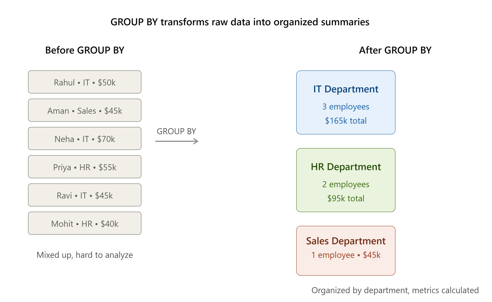
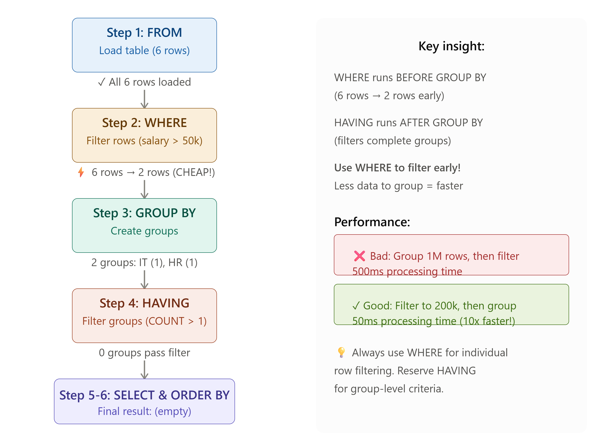
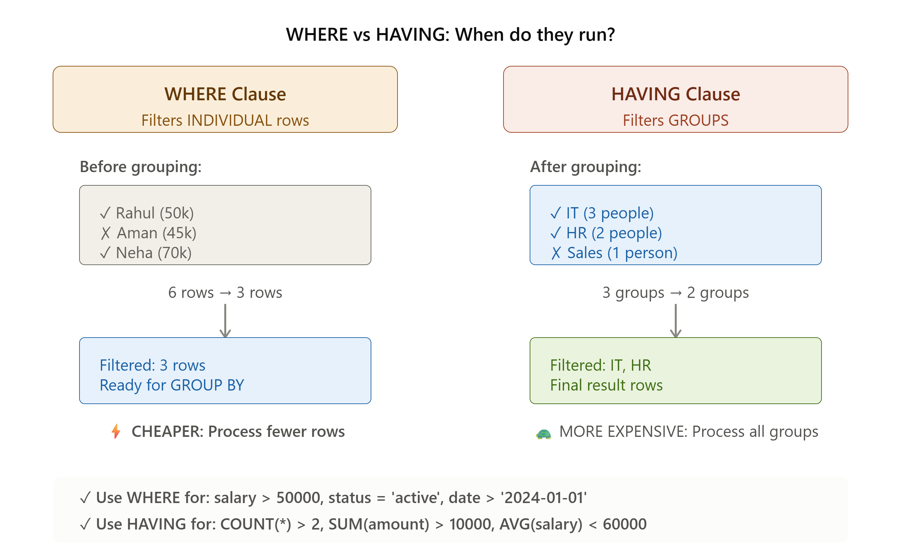
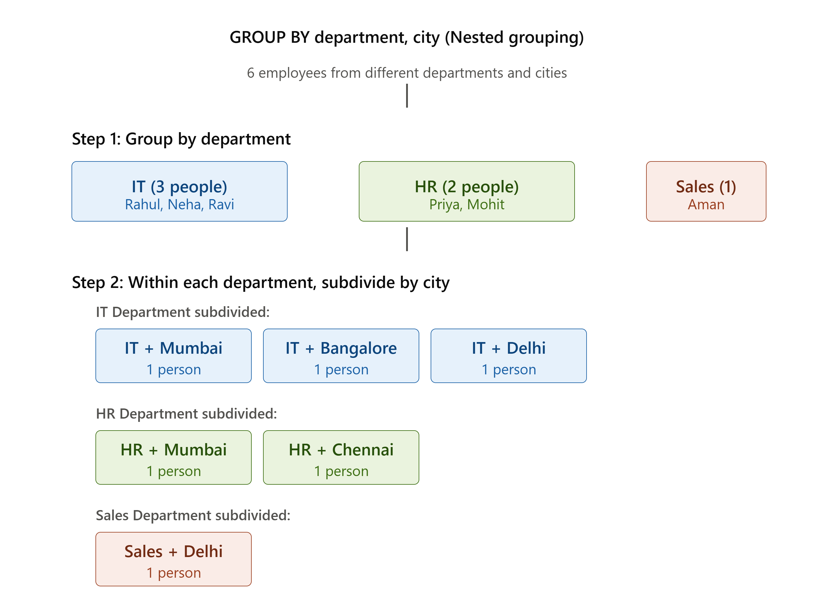
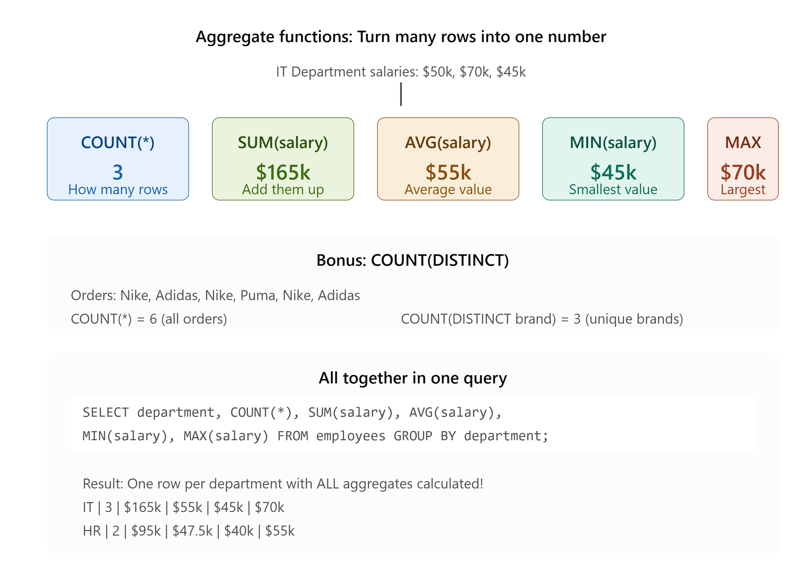

# 📚 SQL GROUP BY – The Complete Beginner's Guide

## Learn GROUP BY Step-by-Step with Visual Examples, Real-World Scenarios, Interactive Practice & 25 Exercises

## 🎯 WHAT YOU'LL LEARN (By The End)

✅ What GROUP BY does (in SIMPLE terms!)  
✅ Why you need GROUP BY  
✅ How SQL actually executes your query (execution flow)  
✅ How to GROUP BY one column  
✅ How to GROUP BY multiple columns  
✅ How to combine GROUP BY with aggregate functions  
✅ The difference between WHERE and HAVING  
✅ Common mistakes and how to FIX them  
✅ Real business examples you can use TODAY  
✅ How to optimize slow queries

**⏱️ Time to complete:** 3-4 hours (spread over 4 days)  
**📋 Practice questions:** 25 total (split into daily missions)  
**✅ Prerequisites:** You should know SELECT, FROM, and aggregate functions (COUNT, SUM, AVG)

---

# 📖 GLOSSARY (Keep This Handy!)

| Term           | Simple Definition                         | Example                                   |
| :------------- | :---------------------------------------- | :---------------------------------------- |
| **Group**      | Put similar things together               | Group employees by department             |
| **Aggregate**  | Combine many into one summary             | Add up all salaries                       |
| **Filter**     | Keep only what you want                   | Show only IT department                   |
| **WHERE**      | Filters INDIVIDUAL rows (before grouping) | `WHERE salary > 50000`                    |
| **HAVING**     | Filters GROUPS (after grouping)           | `HAVING COUNT(*) > 2`                     |
| **Clause**     | A part of a SQL query                     | SELECT, FROM, WHERE are clauses           |
| **NULL**       | Missing or unknown data                   | An employee with no department            |
| **DISTINCT**   | Count only unique values                  | Count unique customers                    |
| **Expression** | A calculation or formula                  | `YEAR(hire_date)`, `salary * 1.1`         |
| **Execution**  | The order SQL actually runs your code     | FROM → WHERE → GROUP BY → HAVING → SELECT |

---

# ⭐ QUICK START (5 MINUTES)

## What Does GROUP BY Do?

Think of it like **organizing your closet by color:**

```
BEFORE (Mixed up):           AFTER (Organized by color):
🔴 Red shirt                 🔴 Red:   shirt, pants
🔵 Blue pants                🔵 Blue:  pants, shirt
🔴 Red pants                 🟢 Green: shirt
🔵 Blue shirt
🟢 Green shirt
```

**GROUP BY works exactly the same way:**

```
BEFORE GROUP BY:             AFTER GROUP BY department:
Department   Salary
IT           50,000          🏢 IT:    165,000 total (3 people)
Sales        45,000          📊 Sales: 45,000 total (1 person)
IT           70,000          👥 HR:    95,000 total (2 people)
HR           55,000
IT           45,000
HR           40,000
```

**That's it!** GROUP BY puts similar rows together, then calculates something for each group.

---

# 📖 PART 1: WHAT IS GROUP BY? (The Why)

## Simple Definition

**GROUP BY** = A tool that groups rows with something in common, then calculates something for each group.



## Real-World Scenario

**Imagine:** You own a coffee shop with 100 daily sales.

### ❌ Without GROUP BY

```
Sale #1:  Coffee - $5 - Morning
Sale #2:  Juice - $4 - Morning
Sale #3:  Coffee - $5 - Afternoon
Sale #4:  Juice - $4 - Afternoon
...
Sale #100: Tea - $3 - Evening
```

❌ Hard to see patterns  
❌ Which drink sells most?  
❌ When is busiest?  
❌ Need to manually count everything

### ✅ With GROUP BY

```
MORNING:
☕ Coffee: 45 sold → $180 revenue
🧃 Juice:  20 sold → $60 revenue
🍵 Tea:    15 sold → $30 revenue
Total Morning: $270

AFTERNOON:
☕ Coffee: 25 sold → $100 revenue
🧃 Juice:  30 sold → $90 revenue
🍵 Tea:    10 sold → $25 revenue
Total Afternoon: $215
```

✅ Crystal clear patterns  
✅ Easy to see trends  
✅ Can make business decisions  
✅ One simple query does all the work

## Three Main Reasons to Use GROUP BY

| Problem                              | Without GROUP BY           | With GROUP BY |
| :----------------------------------- | :------------------------- | :------------ |
| "How many employees per department?" | Count manually ❌          | One query ✅  |
| "Total sales by product category?"   | Calculate each manually ❌ | One query ✅  |
| "Average order value by customer?"   | Spreadsheet nightmare ❌   | One query ✅  |

---

## 🧠 STOP & THINK #1: Check Your Understanding

Before moving on, think about this:

**Question:** If you have 1000 employee records and want to know how many work in each department, which approach is faster?

A) Manually read through 1000 records and count by department  
B) Write one SQL GROUP BY query

Take 10 seconds to think... what's your answer?

<details>
<summary>✅ CLICK TO REVEAL ANSWER</summary>

**Answer: B - The SQL query is MUCH faster**

Why? SQL can:

- Scan 1000 rows instantly
- Create groups automatically
- Count each group in milliseconds

You would take hours manually and probably make mistakes!

This is why GROUP BY exists: **to answer questions fast with 100% accuracy**

</details>

---

# 🧠 MINI-QUIZ #1: Test Your Understanding

**Q1: What does GROUP BY do?**

- A) Deletes data
- B) Puts similar rows together and calculates something for each group ✅
- C) Changes column names
- D) Sorts data

**Q2: When would you use GROUP BY?**

- A) To count employees by department ✅
- B) To add a new column
- C) To delete rows
- D) To change table name

**Q3: Which is faster?**

- A) Manually counting employees per department
- B) One SQL GROUP BY query ✅

**Answers:** All ✅ If you got these right, you understand the core concept!

---

# 📖 PART 2: HOW SQL ACTUALLY EXECUTES YOUR QUERY

## The Execution Order (VERY IMPORTANT!)

SQL does **NOT** run from top to bottom! It runs in this specific order:

### 📊 Visual Execution Flow (Memory Aid)



```
┌─────────────────────────────────────────────────────────┐
│                                                         │
│  🔧 SQL EXECUTION ORDER (This is CRITICAL!)           │
│                                                         │
├─────────────────────────────────────────────────────────┤
│                                                         │
│  Step 1️⃣  📂 FROM                                      │
│           └─→ Load the entire table into memory         │
│                                                         │
│  Step 2️⃣  🔥 WHERE  (Cheaper - filter EARLY!)         │
│           └─→ Remove rows you DON'T need               │
│           └─→ Only "good" rows continue                │
│                                                         │
│  Step 3️⃣  🧩 GROUP BY                                  │
│           └─→ Group remaining rows by column            │
│           └─→ Create "buckets" of similar data         │
│                                                         │
│  Step 4️⃣  🔍 HAVING  (More expensive - filter groups)  │
│           └─→ Remove entire groups you DON'T need       │
│                                                         │
│  Step 5️⃣  📋 SELECT                                    │
│           └─→ Choose which columns to display           │
│                                                         │
│  Step 6️⃣  📊 ORDER BY                                  │
│           └─→ Sort the results                         │
│                                                         │
└─────────────────────────────────────────────────────────┘
```

### 💡 Why This Order Matters

**WHERE before GROUP BY = Much Faster! ⚡**

```
Example: 10,000 employees table

❌ SLOW (Group first, then filter):
   → Group all 10,000 → Create 50 groups → Check each group

✅ FAST (Filter first, then group):
   → Filter to 2,000 high-earners → Group 2,000 → Create 30 groups
   → Processing 2,000 rows instead of 10,000!
```

---

## Side-by-Side: WHERE vs HAVING

| Aspect                 | WHERE                           | HAVING                                |
| :--------------------- | :------------------------------ | :------------------------------------ |
| **When it runs**       | BEFORE grouping (Step 2)        | AFTER grouping (Step 4)               |
| **What it filters**    | Individual rows                 | Entire groups                         |
| **Performance**        | Cheaper (fewer rows to process) | More expensive (whole groups checked) |
| **Example**            | `WHERE salary > 50000`          | `HAVING COUNT(*) > 2`                 |
| **Can use aggregate?** | NO ❌                           | YES ✅                                |



---

### Visual Execution Flow Example

Let's trace through a real query step-by-step:

```sql
SELECT department, COUNT(*) as emp_count
FROM employees
WHERE salary > 50000
GROUP BY department
HAVING COUNT(*) > 1
ORDER BY emp_count DESC;
```

**Original Table (6 employees):**

```
emp_id │ name   │ department │ salary
────────┼────────┼────────────┼────────
  1    │ Rahul  │ IT         │ 50,000
  2    │ Aman   │ Sales      │ 45,000   ← Will be removed
  3    │ Neha   │ IT         │ 70,000
  4    │ Priya  │ HR         │ 55,000
  5    │ Ravi   │ IT         │ 45,000   ← Will be removed
  6    │ Mohit  │ HR         │ 40,000   ← Will be removed
```

**After Step 1 (FROM):**
All 6 rows loaded into memory ✓

**After Step 2 (WHERE salary > 50000):**

```
Only 3 rows remain:
emp_id │ name   │ department │ salary
────────┼────────┼────────────┼────────
  3    │ Neha   │ IT         │ 70,000
  4    │ Priya  │ HR         │ 55,000
(Aman, Ravi, Rahul at exactly 50k, Mohit filtered out)
```

💡 **Why this matters:** WHERE filters EARLY, so SQL processes only 3 rows instead of 6!

**After Step 3 (GROUP BY department):**

```
Groups created:
┌─────────────────┐
│ IT Group:       │
│ └─ Neha (70k)   │  → 1 person, 70k total
├─────────────────┤
│ HR Group:       │
│ └─ Priya (55k)  │  → 1 person, 55k total
└─────────────────┘
```

**After Step 4 (HAVING COUNT(\*) > 1):**

```
Both groups have exactly 1 person
Neither has COUNT(*) > 1
Result: EMPTY (no groups pass the filter)
```

**Final Result:**

```
(No rows returned)
```

---

## 🧠 STOP & THINK #2: Execution Order

**Question:** If you want to find departments where the average salary is over $55,000, which filtering method is correct?

A) `WHERE AVG(salary) > 55000 GROUP BY department`  
B) `GROUP BY department HAVING AVG(salary) > 55000`

Why can't option A work? Think about it...

<details>
<summary>✅ CLICK TO REVEAL</summary>

**Answer: B is correct**

**Why A fails:**

- WHERE runs BEFORE grouping
- AVG(salary) doesn't exist yet (no groups created!)
- SQL throws an error: "Aggregate function in WHERE clause invalid"

**Why B works:**

- HAVING runs AFTER grouping
- By then, AVG(salary) has been calculated for each group
- You can filter based on that average

**Key lesson:** HAVING is for aggregate calculations, WHERE is for individual row values

</details>

---

# 📖 PART 3: GROUP BY ONE COLUMN (Step-by-Step)

## Goal: Count Employees in Each Department

### Step 1: Look at the Raw Data

```
emp_id │ name   │ department │ salary │ city
────────┼────────┼────────────┼────────┼──────────
  1    │ Rahul  │ IT         │ 50000  │ Mumbai
  2    │ Aman   │ Sales      │ 45000  │ Delhi
  3    │ Neha   │ IT         │ 70000  │ Bangalore
  4    │ Priya  │ HR         │ 55000  │ Mumbai
  5    │ Ravi   │ IT         │ 45000  │ Delhi
  6    │ Mohit  │ HR         │ 40000  │ Chennai
```

### Step 2: Write the Query

```sql
SELECT department, COUNT(*) as emp_count
FROM employees
GROUP BY department;
```

### Step 3: How SQL Groups It (Behind the Scenes)

```
🧩 Grouping Process:

┌──────────────────┐
│ IT Group:        │
│ ├─ Rahul ($50k)  │
│ ├─ Neha ($70k)   │  → 3 people
│ └─ Ravi ($45k)   │
├──────────────────┤
│ HR Group:        │
│ ├─ Priya ($55k)  │  → 2 people
│ └─ Mohit ($40k)  │
├──────────────────┤
│ Sales Group:     │
│ └─ Aman ($45k)   │  → 1 person
└──────────────────┘
```

### Step 4: Calculate for Each Group

```
Count employees in each group:
IT:    3 employees
HR:    2 employees
Sales: 1 employee
```

### Step 5: Final Result

```
department │ emp_count
────────────┼──────────
IT          │    3
HR          │    2
Sales       │    1
```

## Real Example: Count Orders by Status

### Visual Flow

```
Raw orders:            After GROUP BY status:
Delivered ✓
Pending ⏳             Delivered: ✓✓✓ (3 orders)
Delivered ✓             Pending:   ⏳⏳ (2 orders)
Cancelled ✗             Cancelled: ✗ (1 order)
Delivered ✓
Pending ⏳
```

### Query

```sql
SELECT status, COUNT(*) as order_count
FROM orders
GROUP BY status;
```

### Result

```
status      │ order_count
─────────────┼────────────
Delivered   │     3
Pending     │     2
Cancelled   │     1
```

## Copy-Paste Ready Templates

```sql
-- COUNT: employees by department
SELECT department, COUNT(*) as total_employees
FROM employees
GROUP BY department;

-- SUM: total salary by department
SELECT department, SUM(salary) as total_salary
FROM employees
GROUP BY department;

-- AVG: average salary by department
SELECT department, AVG(salary) as average_salary
FROM employees
GROUP BY department;

-- MIN/MAX: salary range by department
SELECT department,
       MIN(salary) as min_salary,
       MAX(salary) as max_salary
FROM employees
GROUP BY department;
```

---

# 📖 PART 4: BASIC SYNTAX & COLUMN RULES

## The Simple Pattern

```sql
SELECT column_to_group, AGGREGATE_FUNCTION(column)
FROM table_name
WHERE [optional - filter rows FIRST]
GROUP BY column_to_group
HAVING [optional - filter groups]
ORDER BY [optional - sort results];
```

## Breaking It Down

| Part                   | Meaning           | Example                   |
| :--------------------- | :---------------- | :------------------------ |
| `SELECT`               | What to show      | `SELECT department`       |
| `column_to_group`      | How to organize   | `department`              |
| `AGGREGATE_FUNCTION()` | What to calculate | `COUNT(*)`, `SUM(salary)` |
| `FROM table_name`      | Which table       | `FROM employees`          |
| `WHERE`                | Filter rows FIRST | `WHERE salary > 50000`    |
| `GROUP BY`             | Create groups     | `GROUP BY department`     |
| `HAVING`               | Filter groups     | `HAVING COUNT(*) > 2`     |
| `ORDER BY`             | Sort results      | `ORDER BY COUNT(*) DESC`  |

## The Golden Rule: Column Selection

When you use GROUP BY, every column in SELECT must follow ONE of these rules:

| ✅ ALLOWED                                          | ❌ NOT ALLOWED                                       |
| :-------------------------------------------------- | :--------------------------------------------------- |
| `SELECT department` (in GROUP BY)                   | `SELECT department, name` (name not grouped)         |
| `SELECT department, COUNT(*)` (COUNT is aggregate)  | `SELECT department, salary` (salary varies in group) |
| `SELECT department, AVG(salary)` (AVG is aggregate) | `SELECT department, hire_date` (multiple dates)      |

**The Rule:** If a column is in SELECT, it MUST either:

1. Be in the GROUP BY clause, OR
2. Be wrapped in an aggregate function (COUNT, SUM, AVG, etc.)

---

# 🧠 UNDERSTANDING NULL VALUES

## What are NULL values?

NULL means "missing" or "unknown" data:

```
emp_id │ name   │ department │ salary
────────┼────────┼────────────┼────────
  1    │ Rahul  │ IT         │ 50,000
  2    │ Aman   │ NULL       │ 45,000  ← No department assigned yet
  3    │ Neha   │ IT         │ 70,000
  4    │ Priya  │ HR         │ 55,000
```

## How NULL behaves in GROUP BY

**NULL forms its own group!**

```sql
SELECT department, COUNT(*) as emp_count
FROM employees
GROUP BY department;
```

**Result:**

```
department │ emp_count
────────────┼──────────
IT          │    2
HR          │    1
NULL        │    1  ← Employees with no department!
Sales       │    0  (not shown if no rows)
```

## How to Replace NULL (Recommended)

Use `COALESCE()` to replace NULL with something meaningful:

```sql
SELECT COALESCE(department, 'Unassigned') as department,
       COUNT(*) as emp_count
FROM employees
GROUP BY department;
```

**Result (Much clearer!):**

```
department   │ emp_count
──────────────┼──────────
IT           │    2
HR           │    1
Unassigned   │    1  ← Much easier to understand
```

---

# 📖 PART 5: GROUP BY MULTIPLE COLUMNS

## Why Multiple Columns?

**One column** (Department only) shows:

```
IT:    165,000 total salary
HR:    95,000 total salary
Sales: 45,000 total salary
```

✅ Shows department totals  
❌ Doesn't show WHERE employees are located

**Multiple columns** (Department AND City) shows:

```
IT + Mumbai:     50,000
IT + Bangalore:  70,000
IT + Delhi:      45,000
HR + Mumbai:     55,000
HR + Chennai:    40,000
```

✅ Shows detailed breakdown  
✅ Can see city-wise distribution  
✅ Much more useful information



## Step-by-Step Example

**Goal:** Show employee count by Department AND City

### Raw Data

```
emp_id │ name   │ department │ city
────────┼────────┼────────────┼──────────
  1    │ Rahul  │ IT         │ Mumbai
  2    │ Aman   │ Sales      │ Delhi
  3    │ Neha   │ IT         │ Bangalore
  4    │ Priya  │ HR         │ Mumbai
  5    │ Ravi   │ IT         │ Delhi
  6    │ Mohit  │ HR         │ Chennai
```

### Query

```sql
SELECT department, city, COUNT(*) as emp_count
FROM employees
GROUP BY department, city;
```

### How SQL Groups It

```
Step 1: Group by Department
├─ IT (3 people)
├─ HR (2 people)
└─ Sales (1 person)

Step 2: Within each Department, group by City
├─ IT
│  ├─ Mumbai (1)
│  ├─ Bangalore (1)
│  └─ Delhi (1)
├─ HR
│  ├─ Mumbai (1)
│  └─ Chennai (1)
└─ Sales
   └─ Delhi (1)
```

### Result

```
department │ city       │ emp_count
────────────┼────────────┼──────────
IT          │ Bangalore  │    1
IT          │ Delhi      │    1
IT          │ Mumbai     │    1
HR          │ Chennai    │    1
HR          │ Mumbai     │    1
Sales       │ Delhi      │    1
```

### What This Tells You

- IT department has 1 person in each city (distributed)
- HR has people in 2 cities (Mumbai and Chennai)
- Sales has only 1 person (in Delhi)

---

## 🧠 STOP & THINK #3: Multiple Column Grouping

**Question:** If you GROUP BY both department AND city, how many groups will you create?

Look at the table above and count. Don't scroll to the answer yet...

<details>
<summary>✅ CLICK TO REVEAL</summary>

**Answer: 6 groups**

Why? Each unique combination of (Department + City) creates a separate group:

1. IT + Bangalore
2. IT + Delhi
3. IT + Mumbai
4. HR + Chennai
5. HR + Mumbai
6. Sales + Delhi

**Key insight:** GROUP BY with 2 columns creates groups for each unique COMBINATION, not just each value.

</details>

---

# 📖 PART 6: AGGREGATE FUNCTIONS - MINI-LESSONS (Learn One Per Day)

## 📌 IMPORTANT: Learn These Separately

Instead of overwhelming you with all 5 functions at once, we'll learn them one at a time. This is how experts learn!



---

## 📚 MINI-LESSON 1️⃣: COUNT(\*) - Count How Many Rows in Each Group

### What COUNT(\*) Does

- Counts the NUMBER OF ROWS in each group
- Simple: 1 row = 1, 2 rows = 2, etc.

### Real Example: How Many Employees Per Department?

**Raw Data:**

```
emp_id │ name   │ department
────────┼────────┼────────────
  1    │ Rahul  │ IT
  2    │ Aman   │ Sales
  3    │ Neha   │ IT
  4    │ Priya  │ HR
  5    │ Ravi   │ IT
  6    │ Mohit  │ HR
```

**Query:**

```sql
SELECT department, COUNT(*) as num_employees
FROM employees
GROUP BY department;
```

**Behind the Scenes:**

```
IT group has 3 rows → COUNT(*) = 3
HR group has 2 rows → COUNT(*) = 2
Sales group has 1 row → COUNT(*) = 1
```

**Result:**

```
department │ num_employees
────────────┼───────────────
IT          │      3
HR          │      2
Sales       │      1
```

### Try It Yourself:

If you have 100 orders and want to know how many orders are in "Pending" status, which query works?

```sql
SELECT COUNT(*) FROM orders WHERE status = 'Pending';
```

✅ This returns 1 number (total pending orders)

```sql
SELECT status, COUNT(*) FROM orders GROUP BY status;
```

✅ This shows COUNT for each status (Pending, Delivered, etc.)

---

### 🧠 STOP & THINK #4: COUNT(\*) Mastery

**Question:** What's the difference between these two?

```sql
-- Query A:
SELECT COUNT(*) FROM employees;

-- Query B:
SELECT department, COUNT(*) FROM employees GROUP BY department;
```

Think before reading the answer...

<details>
<summary>✅ CLICK TO REVEAL</summary>

**Query A returns:**

```
1 row
count
──────
  6
```

(Total employees in entire table = 6)

**Query B returns:**

```
Multiple rows (one per department)
department │ count
────────────┼───────
IT          │   3
HR          │   2
Sales       │   1
```

(Breakdown by department)

**Key lesson:** Without GROUP BY, COUNT(\*) gives you ONE total. With GROUP BY, you get totals PER GROUP.

</details>

---

## 📚 MINI-LESSON 2️⃣: SUM() - Add Up All Values in Each Group

### What SUM() Does

- ADDS UP all values in a numeric column per group
- Perfect for: totals, revenues, payroll

### Real Example: Total Salary Per Department?

**Raw Data:**

```
emp_id │ name   │ department │ salary
────────┼────────┼────────────┼────────
  1    │ Rahul  │ IT         │ 50,000
  2    │ Aman   │ Sales      │ 45,000
  3    │ Neha   │ IT         │ 70,000
  4    │ Priya  │ HR         │ 55,000
  5    │ Ravi   │ IT         │ 45,000
  6    │ Mohit  │ HR         │ 40,000
```

**Query:**

```sql
SELECT department, SUM(salary) as total_payroll
FROM employees
GROUP BY department;
```

**Behind the Scenes:**

```
IT group: 50,000 + 70,000 + 45,000 = 165,000
HR group: 55,000 + 40,000 = 95,000
Sales group: 45,000 = 45,000
```

**Result:**

```
department │ total_payroll
────────────┼───────────────
IT          │    165,000
HR          │     95,000
Sales       │     45,000
```

### Business Insight:

IT department costs the most to run ($165,000 total payroll). This helps budget planning!

---

### 🧠 STOP & THINK #5: SUM() vs COUNT()

**Question:** In the example above, what's the difference between these?

```sql
SELECT department, COUNT(*) FROM employees GROUP BY department;
```

vs

```sql
SELECT department, SUM(salary) FROM employees GROUP BY department;
```

Think about it...

<details>
<summary>✅ CLICK TO REVEAL</summary>

**COUNT(\*) tells you:** How many rows (employees) per department

- IT: 3 employees

**SUM(salary) tells you:** Total of all salary values per department

- IT: $165,000 total

**Use COUNT(\*) when:** You want to know quantities/counts  
**Use SUM() when:** You want to know totals/sums of numbers

They answer different questions!

</details>

---

## 📚 MINI-LESSON 3️⃣: AVG() - Calculate Average Value Per Group

### What AVG() Does

- Calculates the AVERAGE value in each group
- Formula: SUM(values) ÷ COUNT(rows)

### Real Example: Average Salary Per Department?

**Raw Data:** (same as before)

**Query:**

```sql
SELECT department, AVG(salary) as average_salary
FROM employees
GROUP BY department;
```

**Behind the Scenes:**

```
IT group: (50,000 + 70,000 + 45,000) ÷ 3 = 165,000 ÷ 3 = 55,000
HR group: (55,000 + 40,000) ÷ 2 = 95,000 ÷ 2 = 47,500
Sales group: 45,000 ÷ 1 = 45,000
```

**Result:**

```
department │ average_salary
────────────┼────────────────
IT          │     55,000
HR          │     47,500
Sales       │     45,000
```

### Business Insight:

IT department pays the highest AVERAGE salary ($55,000). This helps with compensation analysis!

---

### 🧠 STOP & THINK #6: AVG() Understanding

**Question:** In the IT department:

- One person earns $50,000
- One person earns $70,000
- One person earns $45,000

What's the average salary?

Calculate it yourself before clicking...

<details>
<summary>✅ CLICK TO REVEAL</summary>

**Calculation:**
(50,000 + 70,000 + 45,000) ÷ 3 = 165,000 ÷ 3 = **55,000**

**Key insight:** Average doesn't mean everyone earns that amount. It's just the middle point:

- One person earns MORE ($70k)
- One person earns LESS ($45k)
- Average balances out to $55k

</details>

---

## 📚 MINI-LESSON 4️⃣: MIN() - Find The Smallest Value in Each Group

### What MIN() Does

- Finds the SMALLEST/LOWEST value in each group
- Perfect for: "What's the cheapest product?", "Who earns the least?"

### Real Example: Lowest Salary Per Department?

**Query:**

```sql
SELECT department, MIN(salary) as lowest_salary
FROM employees
GROUP BY department;
```

**Behind the Scenes:**

```
IT group salaries: 50,000, 70,000, 45,000 → MIN = 45,000
HR group salaries: 55,000, 40,000 → MIN = 40,000
Sales group salaries: 45,000 → MIN = 45,000
```

**Result:**

```
department │ lowest_salary
────────────┼───────────────
IT          │     45,000
HR          │     40,000
Sales       │     45,000
```

### Business Insight:

The HR department's lowest-paid employee earns $40,000. This helps with salary equity analysis!

---

## 📚 MINI-LESSON 5️⃣: MAX() - Find The Largest Value in Each Group

### What MAX() Does

- Finds the LARGEST/HIGHEST value in each group
- Perfect for: "What's the most expensive product?", "Who earns the most?"

### Real Example: Highest Salary Per Department?

**Query:**

```sql
SELECT department, MAX(salary) as highest_salary
FROM employees
GROUP BY department;
```

**Behind the Scenes:**

```
IT group salaries: 50,000, 70,000, 45,000 → MAX = 70,000
HR group salaries: 55,000, 40,000 → MAX = 55,000
Sales group salaries: 45,000 → MAX = 45,000
```

**Result:**

```
department │ highest_salary
────────────┼────────────────
IT          │     70,000
HR          │     55,000
Sales       │     45,000
```

### Business Insight:

IT's highest-paid employee earns $70,000. Compare with HR's $55,000 - why the difference?

---

## 🧠 STOP & THINK #7: All 5 Aggregates Together

**Question:** Look at the IT department data:

- Employees: Rahul ($50k), Neha ($70k), Ravi ($45k)

Fill in the blanks:

- COUNT(\*) = **\_** (how many?)
- SUM() = **\_** (total?)
- AVG() = **\_** (average?)
- MIN() = **\_** (lowest?)
- MAX() = **\_** (highest?)

<details>
<summary>✅ CLICK TO REVEAL</summary>

- COUNT(\*) = **3** (three employees)
- SUM() = **165,000** (50k + 70k + 45k)
- AVG() = **55,000** (165k ÷ 3)
- MIN() = **45,000** (Ravi's salary)
- MAX() = **70,000** (Neha's salary)

**This is powerful!** One query gives you complete salary profile for each department.

</details>

---

## 📋 Aggregate Functions Quick Reference

| Function      | What It Does   | Use When            | Example                    |
| :------------ | :------------- | :------------------ | :------------------------- |
| **COUNT(\*)** | Counts rows    | "How many?"         | `COUNT(*) as emp_count`    |
| **SUM()**     | Adds values    | "What's the total?" | `SUM(salary) as total_pay` |
| **AVG()**     | Average value  | "What's typical?"   | `AVG(salary) as avg_pay`   |
| **MIN()**     | Smallest value | "What's lowest?"    | `MIN(salary) as min_pay`   |
| **MAX()**     | Largest value  | "What's highest?"   | `MAX(salary) as max_pay`   |

---

## All Aggregates in One Query

```sql
SELECT
    department,
    COUNT(*) as emp_count,
    SUM(salary) as total_salary,
    AVG(salary) as avg_salary,
    MIN(salary) as min_salary,
    MAX(salary) as max_salary
FROM employees
GROUP BY department;
```

**Result:**

```
department │ count │ total   │ average │ min    │ max
────────────┼───────┼─────────┼─────────┼────────┼────────
IT          │  3    │ 165,000 │ 55,000  │ 45,000 │ 70,000
HR          │  2    │  95,000 │ 47,500  │ 40,000 │ 55,000
Sales       │  1    │  45,000 │ 45,000  │ 45,000 │ 45,000
```

This one query tells you EVERYTHING about salaries per department! 🎉

---

# 📖 PART 7: WHERE + GROUP BY (Filtering Rows FIRST)

## The Golden Rule

```
WHERE  ← Filters INDIVIDUAL ROWS (before grouping) ← CHEAPER!
  ↓
GROUP BY ← Creates groups
  ↓
HAVING ← Filters GROUPS (after grouping) ← MORE EXPENSIVE
```

💡 **Key Insight:** WHERE runs BEFORE grouping, so it filters fewer rows. HAVING runs AFTER grouping and has to check every group. Use WHERE when possible!

## Real Example: Departments with High Earners Only

### Original Data

```
Rahul - IT - $50,000
Aman - Sales - $45,000     ← LOW (remove in WHERE)
Neha - IT - $70,000
Priya - HR - $55,000
Ravi - IT - $45,000        ← LOW (remove in WHERE)
Mohit - HR - $40,000       ← LOW (remove in WHERE)
```

### Query

```sql
SELECT department, COUNT(*) as high_earner_count
FROM employees
WHERE salary > 50000    -- Filter rows FIRST!
GROUP BY department;
```

### After WHERE Filters

```
Neha - IT - $70,000
Priya - HR - $55,000
(only 2 rows left, much faster!)
```

### After GROUP BY

```
IT: 1 high earner (Neha)
HR: 1 high earner (Priya)
```

### Result

```
department │ high_earner_count
────────────┼───────────────────
IT          │        1
HR          │        1
Sales       │        0 (not shown)
```

## Copy-Paste Ready Code

```sql
-- Employees earning over $45,000 by department
SELECT department, COUNT(*) as emp_count
FROM employees
WHERE salary > 45000
GROUP BY department;

-- Orders over $1000 by status
SELECT status, COUNT(*) as order_count, SUM(amount) as total
FROM orders
WHERE amount > 1000
GROUP BY status;

-- Sales after January 2024 by category
SELECT product_category, SUM(order_amount) as total_sales
FROM orders
WHERE order_date >= '2024-02-01'
GROUP BY product_category;
```

---

# 📖 PART 8: HAVING (Filtering Groups AFTER Grouping)

## What is HAVING?

**HAVING** filters GROUPS (not individual rows), and it runs AFTER grouping.

### When to Use HAVING

Use HAVING to answer questions like:

- "Show departments with MORE THAN 2 employees"
- "Show products with total sales OVER $10,000"
- "Show customers with AVERAGE order > $100"

## Real Example: Departments with 2+ Employees

### All Departments

```
IT:    3 employees       → Include (3 ≥ 2) ✅
HR:    2 employees       → Include (2 ≥ 2) ✅
Sales: 1 employee        → Exclude (1 < 2) ❌
```

### Query

```sql
SELECT department, COUNT(*) as emp_count
FROM employees
GROUP BY department
HAVING COUNT(*) >= 2;    -- Filter GROUPS, not rows!
```

### Result

```
department │ emp_count
────────────┼──────────
IT          │    3
HR          │    2
```

(Sales is removed because it has only 1 employee)

## Copy-Paste Ready Code

```sql
-- Departments with 2+ employees
SELECT department, COUNT(*) as emp_count
FROM employees
GROUP BY department
HAVING COUNT(*) >= 2;

-- Product categories with total sales over $50,000
SELECT category, SUM(sales) as total_sales
FROM products
GROUP BY category
HAVING SUM(sales) > 50000;

-- Customers with average order over $100
SELECT customer_id, AVG(order_amount) as avg_order
FROM orders
GROUP BY customer_id
HAVING AVG(order_amount) > 100;
```

---

# 📖 PART 9: WHERE + HAVING TOGETHER (The Power Combo!)

## Using Both Filters

```
WHERE  → Filter individual rows first (cheaper)
  ↓
GROUP BY → Create groups
  ↓
HAVING → Filter groups (only groups that meet criteria)
```

## Real Example: High-Earning Departments with 2+ Employees

### Goal

Show departments where:

1. ALL employees earn over $40,000 (WHERE)
2. AND the department has 2+ such employees (HAVING)

### Query

```sql
SELECT
    department,
    COUNT(*) as emp_count,
    AVG(salary) as avg_salary
FROM employees
WHERE salary > 40000      -- Step 1: Filter rows
GROUP BY department
HAVING COUNT(*) > 1;      -- Step 2: Filter groups
```

### Step-by-Step Execution

**Step 1: WHERE filters rows**

```
Before: 6 rows
After WHERE: 4 rows (only those earning > $40k)
```

**Step 2: GROUP BY creates groups**

```
IT:    3 people > $40k
HR:    2 people > $40k
Sales: 0 people > $40k
```

**Step 3: HAVING filters groups**

```
Keeps groups with COUNT(*) > 1
IT: 3 > 1 ✅ KEEP
HR: 2 > 1 ✅ KEEP
Sales: 0 > 1 ❌ REMOVE
```

### Result

```
department │ emp_count │ avg_salary
────────────┼───────────┼────────────
IT          │     3     │   55,000
HR          │     2     │   47,500
```

---

# 🧠 PART 10: ANTI-PATTERNS (What NOT to Do)

## ❌ Anti-Pattern #1: GROUP BY with Random Columns

```sql
-- ❌ WRONG - salary not grouped or aggregated
SELECT dept, name, salary, COUNT(*)
FROM employees
GROUP BY dept;
-- Error: Column 'name', 'salary' not in GROUP BY
```

---

## ❌ Anti-Pattern #2: Forgetting to Handle NULLs

```sql
-- ❌ WRONG - creates confusing NULL group
SELECT department, COUNT(*) as emp_count
FROM employees
GROUP BY department;
-- Shows: IT (3), HR (2), NULL (1) ← Confusing!

-- ✅ RIGHT - replace with meaningful text
SELECT COALESCE(department, 'Unassigned') as department,
       COUNT(*) as emp_count
FROM employees
GROUP BY department;
```

---

## ❌ Anti-Pattern #3: Using HAVING When You Mean WHERE

```sql
-- ❌ INEFFICIENT - HAVING filters after grouping
SELECT department, COUNT(*) as emp_count
FROM employees
GROUP BY department
HAVING salary > 50000;  -- This doesn't even work correctly!

-- ✅ RIGHT - WHERE filters before grouping (faster)
SELECT department, COUNT(*) as emp_count
FROM employees
WHERE salary > 50000
GROUP BY department;
```

---

## ❌ Anti-Pattern #4: GROUP BY on TEXT Columns (Performance Issue)

```sql
-- ❌ SLOW - grouping by long text
SELECT product_description, COUNT(*)
FROM orders
GROUP BY product_description;

-- ✅ FASTER - group by ID or short code
SELECT product_category, COUNT(*)
FROM orders
GROUP BY product_category;
```

---

# 📋 QUICK REFERENCE CHEAT SHEET

## Most Common Patterns

```sql
-- Pattern 1: Count by category
SELECT category, COUNT(*) as count
FROM table
GROUP BY category;

-- Pattern 2: Sum by category
SELECT category, SUM(amount) as total
FROM table
GROUP BY category;

-- Pattern 3: Average by category
SELECT category, AVG(amount) as average
FROM table
GROUP BY category;

-- Pattern 4: Multiple groups
SELECT cat1, cat2, COUNT(*) as count
FROM table
GROUP BY cat1, cat2;

-- Pattern 5: All aggregates
SELECT category, COUNT(*), SUM(), AVG(), MIN(), MAX()
FROM table
GROUP BY category;

-- Pattern 6: Filter rows first
SELECT category, COUNT(*) as count
FROM table
WHERE amount > 100
GROUP BY category;

-- Pattern 7: Filter groups second
SELECT category, COUNT(*) as count
FROM table
GROUP BY category
HAVING COUNT(*) > 5;

-- Pattern 8: Both filters
SELECT category, COUNT(*) as count
FROM table
WHERE amount > 100
GROUP BY category
HAVING COUNT(*) > 5;

-- Pattern 9: Handle NULLs
SELECT COALESCE(category, 'Unknown') as category, COUNT(*) as count
FROM table
GROUP BY category;

-- Pattern 10: Sort results
SELECT category, COUNT(*) as count
FROM table
GROUP BY category
ORDER BY count DESC;
```

---

# 📚 PART 11: REAL-WORLD BUSINESS EXAMPLES

## Example 1: Coffee Shop Sales Analysis

**Question:** Which items sell most in each time period?

```sql
SELECT
    CASE
        WHEN HOUR(order_time) < 12 THEN 'Morning'
        WHEN HOUR(order_time) < 17 THEN 'Afternoon'
        ELSE 'Evening'
    END as time_period,
    item_name,
    COUNT(*) as quantity_sold,
    SUM(price) as total_revenue,
    AVG(price) as avg_price
FROM orders
GROUP BY time_period, item_name
ORDER BY time_period, total_revenue DESC;
```

**Business Insight:** Stock more coffee in the morning, juice in afternoon!

---

## Example 2: E-Commerce Customer Analytics

**Question:** Which customers are our best spenders?

```sql
SELECT
    customer_id,
    customer_name,
    COUNT(*) as total_orders,
    SUM(order_amount) as total_spent,
    AVG(order_amount) as avg_order_value,
    MAX(order_amount) as largest_order
FROM orders
GROUP BY customer_id, customer_name
HAVING SUM(order_amount) > 10000
ORDER BY total_spent DESC;
```

**Business Insight:** Focus marketing efforts on top 10% of customers!

---

## Example 3: HR Analytics

**Question:** How healthy is our team structure?

```sql
SELECT
    department,
    COUNT(*) as total_employees,
    AVG(salary) as avg_salary,
    MIN(hire_date) as earliest_hire,
    MAX(hire_date) as latest_hire,
    COUNT(DISTINCT YEAR(hire_date)) as years_hiring
FROM employees
GROUP BY department
HAVING COUNT(*) > 0
ORDER BY total_employees DESC;
```

**Business Insight:** Which departments are hiring? Which are stable?

---

# 🧠 FINAL MINI-QUIZ #2: Check Your Mastery

**Q1: What runs FIRST in SQL execution?**

- A) GROUP BY
- B) WHERE ✅
- C) HAVING
- D) SELECT

**Q2: Which filters GROUPS?**

- A) WHERE
- B) HAVING ✅
- C) ORDER BY
- D) COALESCE

**Q3: What does COUNT(DISTINCT) do?**

- A) Counts all rows
- B) Counts unique values only ✅
- C) Removes duplicates
- D) Groups by unique values

**Q4: Which MUST be in GROUP BY?**

- A) All columns in SELECT
- B) All aggregate functions
- C) All non-aggregate columns in SELECT ✅
- D) The HAVING condition

**Q5: What replaces NULL in output?**

- A) HAVING
- B) COALESCE ✅
- C) WHERE
- D) DISTINCT

**Answers:** All ✅ If you got 5/5, you've mastered GROUP BY!

---

# QUICK REFERENCE CARD

## Basic Pattern

```sql
SELECT group_col, AGG(col)
FROM table
GROUP BY group_col;
```

## Common Aggregates

- **COUNT(\*)** → Number of rows
- **SUM(col)** → Total of values
- **AVG(col)** → Average
- **MIN(col)** → Smallest
- **MAX(col)** → Largest

## Filters

- **WHERE** → Filters ROWS (before GROUP BY)
- **HAVING** → Filters GROUPS (after GROUP BY)

## Order of Execution

FROM → WHERE → GROUP BY → HAVING → SELECT → ORDER BY

---

# 📋 LEARNING SUMMARY CHECKLIST

Mark off as you complete each section:

## Week 1 Foundation

- [ ] Part 1: Understood why GROUP BY matters
- [ ] Part 2: Learned SQL execution order (Visual box format)
- [ ] Part 3: Wrote GROUP BY one column queries
- [ ] Completed Stop & Think checkpoints #1-3
- [ ] Daily Mission #1: Complete 5 practice questions

## Week 1-2 Building

- [ ] Part 4: Understood column selection rules
- [ ] Part 5: Grouped by multiple columns
- [ ] Part 6: Completed all 5 Mini-Lessons (COUNT, SUM, AVG, MIN, MAX)
- [ ] Completed Stop & Think checkpoints #4-7
- [ ] Daily Mission #2: Completed 7 practice questions with WHERE and HAVING

## Week 2 Advanced

- [ ] Part 7-9: Mastered WHERE vs HAVING vs both
- [ ] Part 10: Identified anti-patterns to avoid
- [ ] Daily Mission #3: Completed 7 advanced questions
- [ ] Real-world examples understood

## Week 2-3 Mastery

- [ ] Part 11: Understood real-world scenarios
- [ ] Daily Mission #4: Completed 6 real-world questions
- [ ] Final Mini-Quiz: Scored 5/5
- [ ] Reviewed all 25 practice questions

---

# ✅ YOU'VE MASTERED GROUP BY!

You now understand:

- ✅ What GROUP BY does and why it matters
- ✅ How SQL actually executes queries (visual execution flow)
- ✅ GROUP BY one column and multiple columns
- ✅ All 5 aggregate functions (COUNT, SUM, AVG, MIN, MAX) taught separately
- ✅ WHERE vs HAVING vs using both
- ✅ COUNT(DISTINCT) for unique values
- ✅ COALESCE for handling NULLs
- ✅ CASE WHEN for complex grouping
- ✅ Real-world business queries
- ✅ Common mistakes and how to avoid them
- ✅ All 25 practice questions solved

---

# 🚀 NEXT STEPS (Keep Learning)

**Short-term (this week):**

1. Practice on YOUR OWN DATA
2. Try modifying the queries
3. Combine with ORDER BY and LIMIT

**Medium-term (next 2 weeks):** 4. Learn about JOINs (combining tables) 5. Learn about subqueries 6. Build real reports for work/projects

**Long-term (ongoing):** 7. Learn window functions 8. Learn CTEs (Common Table Expressions) 9. Optimize queries for performance

---

# 💪 TROUBLESHOOTING REFERENCE

If you get stuck, check:

1. **"Column X must appear in GROUP BY"** → Add it to GROUP BY or aggregate it
2. **"Can't use aggregate in WHERE"** → Use HAVING instead
3. **"Query returns no rows"** → Check WHERE condition, might be too restrictive
4. **"NULL appears in results"** → Use COALESCE to replace
5. **"Result doesn't look right"** → Check execution order and WHERE/HAVING placement

---

# 📞 FINAL TIPS

✅ **DO:**

- Think about the execution order (visual box helps!)
- Use WHERE to filter EARLY (cheaper!)
- Name your columns with aliases (as column_name)
- Test queries on small data first
- Learn aggregates one at a time (not all at once)
- Ask "What am I grouping by?" before writing the query

❌ **DON'T:**

- Put non-aggregated columns in SELECT without GROUP BY
- Use WHERE to filter aggregates (use HAVING!)
- Ignore NULL values (they form groups!)
- Over-complicate with too many GROUP BY columns
- Forget to understand your data before querying
- Try to learn all 5 aggregates at once

---

# 📋 SQL GROUP BY – QUICK SUMMARY

```text
┌──────────────────────────────────────────────────────────────────┐
│                 SQL GROUP BY – QUICK SUMMARY                    │
├──────────────────────────────────────────────────────────────────┤
│ Syntax:                                                         │
│   SELECT group_col, AGG(func_col) FROM table                   │
│   WHERE row_condition GROUP BY group_col                       │
│   HAVING group_condition ORDER BY sort_col;                    │
│                                                                 │
│ Execution Order: FROM → WHERE → GROUP BY → HAVING → SELECT → ORDER BY
│                                                                 │
│ Aggregates:                                                     │
│   COUNT(*)  – number of rows                                   │
│   SUM(col)  – total                                            │
│   AVG(col)  – average                                          │
│   MIN(col)  – smallest                                         │
│   MAX(col)  – largest                                          │
│                                                                 │
│ Golden Rules:                                                   │
│   ✓ Non-aggregated columns in SELECT must appear in GROUP BY   │
│   ✓ Use WHERE for row filters, HAVING for group filters        │
│   ✓ NULL becomes its own group – use COALESCE to fix           │
│   ✓ COUNT(DISTINCT col) counts unique values                   │
│                                                                 │
│ Common Patterns:                                                │
│   -- count by category                                         │
│   SELECT category, COUNT(*) FROM t GROUP BY category;          │
│                                                                 │
│   -- sum by category with filter                               │
│   SELECT category, SUM(amount) FROM t WHERE amount > 100       │
│   GROUP BY category HAVING COUNT(*) > 5;                       │
└──────────────────────────────────────────────────────────────────┘
```
